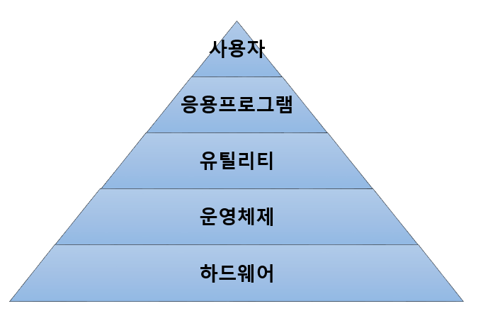

# 운영체제(OS, Operating System)

### 운영체제란

- 하드웨어와 소프트웨어 계층을 연결
- 컴퓨터 시스템의 자원 관리
    - 컴퓨터의 자원은 한정적이라서 자원 관리는 매우 중요
- 사용자가 컴퓨터를 사용할 수 있는 환경을 제공
    - 인터페이스를 제공하여 사용자가 컴퓨터를 편리하게 사용할 수 있는 환경을 제공
- 예시
    - 윈도우, 맥OS, 리눅스, 유닉스 등

- 단어 정리
    - **인터페이스**: 둘 이상의 시스템, 장치, 또는 소프트웨어 사이에 정보를 교환하거나 상호작용하는 데 필요한 '접점' 또는 '매개체'
    - **유틸리티**: 컴퓨터의 시스템 관리 및 유지 보수, 또는 특정 부가 작업을 편리하게 도와주는 소프트웨어, 운영체제에서 제공하는 기능 외에 추가적인 기능을 제공하여 컴퓨터 사용을 더욱 효율적으로 만드는 데 목적

### 운영체제의 목적

- 한정된 자원 안에서 정확하고 빠르게 주어진 문제를 해결하는 것이 목적
- **처리 능력 향상**
    - OS는 자원 관리를 통해 일정 시간 내에 시스템이 처리하는 일의 양을 향상시킴
- **반환 시간 단축**
    - OS는 사용자가 시스템에 요청한 작업을 완료할 때까지 소요되는 시간을 단축시킴
- **사용 가능도 향상**
    - 사용 가능도는 시스템 자원을 얼마나 빨리 제공할 수 있는가를 의미
    - OS는 사용자가 컴퓨터를 사용해야 할 때 자원을 즉시 사용할 수 있게 함
- **신뢰도 향상**
    - 신뢰도는 시스템이 주어진 문제를 정확하게 푸는지를 의미
    - OS는 입력값에 대한 정확한 결과 값을 줄 수 있도록 신뢰도를 향상해야함

### CPU와 메모리 구조

- **CPU**
    - ‘컴퓨터의 뇌’ 역할
    - 컴퓨터에서 프로그램을 실행하는 데 필요한 연산을 처리하고 수행
    - 프로세서
- **메모리**
    - 데이터를 저장하기 위한 기억장치
    - 주 기억장치
        - 휘발성
        - 메인 메모리
        - RAM
    - 보조 기억장치
        - 비휘발성
        - SSD, HDD

- **레지스터**
    - CPU가 사용자 요청을 처리하는 데 필요한 데이터를 **임시로 저장하는 기억장치**
    - CPU 내부에 존재, 접근 속도가 빠름
- **캐시 메모리**
    - CPU와 RAM 사이의 속도차를 해결하기 위한 기억장치
    - CPU내부에 위치, 접근속도 레지스터 다음으로 빠름
- **RAM**
    - 컴퓨터에서 프로그램을 실행할 때 필요한 정보를 저장
    - CPU에서 접근 속도가 하드 디스크보다 빠름
    - **휘발성**
    - 보통 메모리라고 할 때 RAM을 의미
- **하드디스크**
    - 사용자가 필요한 데이터와 프로그램 저장
    - **비휘발성**
- 프로그램 실행 → OS가 디스크에 있는 프로그램을 메모리로 로드
- 로드된 프로그램: **프로세스**, CPU가 처리
- CPU는 하나의 프로세스만 처리 가능
- 멀티 프로세스 환경에서는 OS가 스케줄링을 통해 CPU에 프로세스 할당
- 단어 정리
    - 로드: 프로그램을 메모리에 올려 공간을 할당하는 것
    - 휘발성: 전원 공급이 중단되면 저장된 정보가 없어지는 성질

### 커널과 시스템 콜

- **커널**
    - OS의 핵심 요소
    - 하드웨어, 프로세스의 보안, 자원관리, 하드웨어 추상화 같은 중요한 역할 수행
    - 자원 관리를 위해 CPU 스케줄링, 메모리 관리, 입출력 관리, 파일 시스템 관리 등 담당

- **커널 모드(kernel mode)**
    - 하드웨어에 직접 접근해 메모리, CPU와 같은 자원을 사용
- **사용자 모드(user mode)**
    - 커널 모드의 자원에 접근할 수 없게 제한
    - **사용자 모드에서 실행된 프로세스가 자원에 접근하려면 시스템 콜을 호출해 커널에 요청**
- **시스템 콜(system call)**
    - 사용자 모드에서 커널 모드에 접근해 필요한 기능을 수행할 수 있게 하는 **시스템 함수**
    - 커널은 시스템 콜로 받은 요청을 처리한 후 다시 시스템 콜로 결과 값을 반환

- 시스템 콜을 사용해 프로세스 제어, 파일 조작, 장치 관리, 데이터의 유지 보수, 통신, 보호
- 예시
    - 프로세스를 생성하는 `fork()`
    - 부모 프로세스가 자식 프로세스의 수행을 기다리는 `wait()`