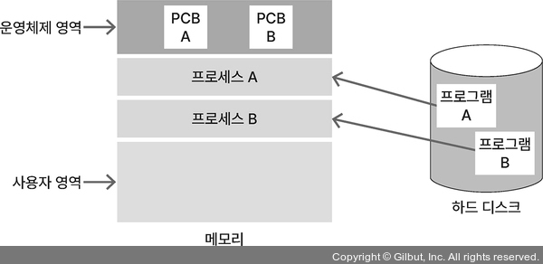

# 프로세스(process)

## 프로세스와 스레드

### **프로세스(process)**

- 컴퓨터에서 **실행 중인** 하나의 **프로그램**
- 프로그램은 특정 작업을 수행하기 위한 **명령어의 집합**
- OS → 프로그램 실행하며 디스크에 저장된 데이터를 메모리로 로드
- 독립된 메모리 영역 할당받고, 다른 프로세스의 메모리 영역에 접근 불가
- **PCB**: 프로세스 제어 블록




### **스택(stack)**

- **지역 변수, 함수의 매개변수, 반환되는 주소 값 등이 저장**되는 영역
- 높은 주소 값에서 낮은 주소 값으로 메모리가 할당되며, 영역 크기는 컴파일 때 결정

### **힙(heap)**

- 사용자에 의해 **동적 메모리 할당**이 일어나는 영역
- C언어에서 `malloc()`으로 할당되는 영역
- 낮은 주소 값에서 높은 주소값으로 메모리가 할당되며, 영역 크기는 런타임 때 결정

### **데이터(data)**

- **전역 변수, 정적 변수, 배열, 구조체 등이 저장**되는 영역
- 데이터 영역은 세부적으로 BSS(Block Stated Symbol) 영역과 데이터 영역으로 다시 구분됨
- **BSS영역**은 초기화 하지 않은 변수, **데이터 영역**은 초기화한 변수를 저장

### **코드(code)**

- 실행할 코드가 **기계어로 컴파일**되어 저장되는 영역
- 텍스트 영역

- 스택과 힙은 동적으로 메모리 할당 가능 → 두 영역 사이에 빈 메모리 공간 존재
- **스택은 LIFO 후입선출**
- **힙은 FIFO 선입선출**


- 메모리 영역을 공유하기 때문에 서로의 영역 침범하는 문제 발생

### **스택 오버플로(stack overflow)**

- 스택이 힙 침범

### **힙 오버플로(heap overflow)**

- 힙이 스택 침범

## **스레드**

- 프로세스는 한 개 이상의 스레드를 가짐
- **프로세스에서 실제로 실행되는 흐름의 단위**
- 프로세스 안에 존재
- 프로세스의 메모리 공간 이용, 지역 변수를 저장하는 스택 영역을 할당
- 전역 변수를 저장하는 힙 영역은 다른 스레드와 공유


### 단어 정리

- 높은 주소 → 낮은 주소: 새로운 데이터를 넣을수록 메모리 주소 값이 줄어든다.
- 오버플로(overflow): 메모리 공간에서 할당할 수 있는 최대범위를 넘어가는 것
- 언더플로(underflow): 메모리 공간에서 할당할 수 잇는 최소 범위보다 작은 것
- 전역 변수(Global variable): **프로그램의 모든 영역에서 접근하고 사용할 수 있는 변수**

## PCB(Process Control Block)

- **OS**는 프로세스를 제어하기 위해 **프로세스 정보를 저장**
- 프로세스가 생성될 때마다 고유의 PCB가 생성되고, 프로세스가 완료되면 PCB는 제거
- 프로세스는 CPU가 처리하던 작업의 내용들을 자신의 PCB에 저장하고, 다음에 다시 CPU를 점유하여 작업을 수행해야 할 때 PCB로부터 해당 정보들을 CPU에 넘겨와서 계속해서 하던 작업을 진행
- PCB 저장 정보


## 프로세스의 생성

- 새로운 프로세스는 기존 프로세스에서 `fork()` 함수를 호출해 생성
- `fork()` 함수를 호출한 프로세스를 복사하는 기능
- 기존 프로세스: 부모 프로세스
- 복사된 프로세스: 자식 프로세스
- 부모 프로세스에서 `fork()` 호출 → 부모 프로세스는 자식 프로세스의 PID 값을, 자식 프로세스는 0을 반환


## 프로세스 상태도

- 모든 프로세스는 CPU에 의해 생성되고 소멸
- 프로세스는 **생성, 준비, 대기, 실행, 종료 5가지 상태로 존재**


### 생성

- 프로세스가 PCB를 가지고 있지만 OS로부터 승인 받기 전

### 생성 → 준비

- 생성 상태의 프로세스가 OS로부터 승인을 받아, 준비 상태의 프로세스가 모여있는 자료구조인 준비 큐에 추가됨

### 준비

- OS로부터 승인받은 후 준비 큐에서 CPU 할당을 기다림

### 준비 → 실행

- 준비 큐에 있는 프로세스 중 우선순위가 높은 프로세스가 디스패치되어 실행

### 실행 → 준비

- CPU 독점을 방지하기 위해 타임아웃되어 준비 상태로 변경

### 실행

- 프로세스가 CPU를 할당받아 실행

### 실행 → 대기

- 입출력 또는 이벤트 때문에 대기 상태로 변경

### 대기 → 준비

- 입출력 또는 이벤트가 완료되어 준비 상태로 변경

### 대기

- 프로세스가 입출력이나 이벤트 발생을 기다려야 해서 CPU 사용을 멈추고 기다림

### 실행 → 종료

- 실행중인 프로세스가 정상적으로 끝나서 종료 상태로 변경

### 종료

- 프로세스 실행을 종료

### 단어 정리

- 승인: CPU를 제외한 다른 자원이 준비되어 해당 프로세스가 준비 상태가 될 수 있도록 OS가 허락하는 것
- 디스패치: 프로세스에 CPU 자원을 할당해 해당 프로세스가 준비 상태에서 실행 상태가 되는 것

## 멀티 프로세스와 멀티 스레드

### 동시성

- 하나의 코어에서 여러 작업을 번갈아 가면서 처리하는 방식
- CPU는 한 번에 하나의 작업만 처리할 수 있어 여러 작업을 조금씩 돌아가면서 처리

### 콘텍스트 스위칭

- 처리 중인 작업을 교체하는 것

### 병렬성

- CPU가 여러개 있어서 각 CPU에서 각 작업을 동시에 처리


### 멀티 프로세스

- 응용 프로그램 하나를 여러 프로세스로 구성하는 것
- 한 프로세스가 죽어도 다른 프로세스에 영향을 주지 않음
- 응용 프로그램을 프로세스 하나로 구성하는 것보다 여러 개로 구성하는 것이 안정적
- 단점: 시간과 메모리 공간 많이 사용

### 오버헤드

- CPU에서 기존에 처리하던 프로세스가 할당 받은 메모리 영역을 다른 프로세스에서 사용할 수 있게 교체하면서 시간과 메모리 필요
- 프로세스는 독립적인 메모리 할당
- IPC를 통해 프로세스 간에 자원 공유
- 직접 참조보다 비효율적


### 멀티 스레드

- 스레드를 여러 개 생성해 스레드들이 각자 다른 작업을 처리하는 것
- 스레드 간에 힙, 데이터, 코드 영역을 공유
- 콘텍스트 스위칭할 때 오버헤드가 적게 발생하고 IPC를 사용하지 않아도 되어 멀티 프로세스의 단점을 보완
- 프로세스를 여러 개 생성하는 것보다 스레드를 여러 개 생성하는 것이 효율적
- 스레드 간 자원 공유가 프로세스 간 자원 공유보다 시스템 처리 비용 적고 프로그램 응답 시간 단축
- 공유 자원에 대한 동기화가 필수
- 스레드에 문제가 생기면 프로세스 내 다른 스레드에 영향을 미칠 가능성


## 콘텍스트 스위칭

### **인터럽트**(interrupt)

- CPU에서 프로세스를 처리하다가 입출력 관련 이벤트가 발생하거나 예외 상황이 발생할 때 이에 대응할 수 있게 CPU에 처리를 요청하는 것
- 인터럽트가 발생하는 경우는 입출력이 발생할 때, CPU 사용 시간이 만료되었을 때, 자식 프로세스를 생성할 때
- CPU는 하나의 프로세스만 처리할 수 있으므로 멀티 프로세스를 처리하려면 CPU 스케줄러에 의해 인터럽트가 발생하면서 콘텍스트 스위칭이 이루어짐

### **콘텍스트**(context)

- CPU가 처리하는 프로세스의 정보

### 콘텍스트 스위칭

- 멀티 프로세스 환경에서 CPU가 처리 중인 프로세스의 정보를 바꾸는 것


- 처리 중인 프로세스를 P1, 다음에 처리해야 하는 프로세스를 P2
- CPU가 P1을 처리하던 중 운영체제에 의해 인터럽트가 발생
- P1은 유휴 상태(idle)로 변하고 스케줄러는 레지스터에 있는 처리 중인 작업 정보를 P1의 PCB에 저장
- P2의 PCB에 있는 정보를 가져와 레지스터에 로드하고 CPU는 P2를 처리하기 시작

### 오버헤드

- P1의 정보를 P1의 PCB에 저장하고, P2의 PCB에 저장된 정보를 레지스터에 로드하는 동안 CPU는 아무 일도 못 함
- 어떤 처리를 하는 데 간접적인 처리 시간과 메모리가 소요될 경우
- 멀티 스레드를 처리할 때도 콘텍스트 스위칭이 이뤄짐
- 멀티 프로세스의 콘텍스트 스위칭보다 시간과 메모리 자원을 적게 사용
- CPU에서 처리 중인 프로세스가 중간에 변경되어도 이전에 실행하던 코드를 이어서 실행할 수 있는 이유는 PCB에 프로그램 카운터와 스택 포인터 값이 저장되어 있기 때문

### **프로그램 카운터**(PC, Program Counter)

- 프로세스가 이어서 처리해야 하는 명령어의 주소 값

### **스택 포인터**(stack pointer)

- 스택 영역에서 데이터가 채워진 가장 높은 주소 값

## 프로세스 동기화

### **경쟁 상태**(race condition)

- 공유 자원에 동시에 접근해 경쟁하는 상태
- 여러 프로세스 또는 스레드에서 하나의 공유 자원에 접근하는 경우가 있는데, 이때 자원에 접근하는 순서에 따라 결과 값이 달라질 가능성


### **임계 영역**(critical section)

- 공유 자원에 접근할 수 있고 접근 순서에 따라 결과가 달라지는 코드 영역

### **프로세스 동기화**(process synchronization)

- 임계 영역에서 경쟁 상태가 발생하는 것을 방지하기 위해 여러 프로세스가 공유 자원에 접근해도 데이터의 일관성이 유지되도록 하는 것

### **상호배제 기법(mutual exclusive)**

- 어떤 프로세스가 임계 영역을 실행 중일 때 다른 프로세스가 임계 영역에 접근 불가
- 상호배제 기법 → 뮤텍스와 세마포어

### **진행(progress)**

- 임계 영역을 실행 중인 프로세스가 없을 때 다른 프로세스가 임계 영역을 실행

### **한정된 대기(bounded waiting)**

- 임계 영역에 접근을 요청했을 때 무한한 시간을 기다리지 않음

### **뮤텍스**(mutex)

- **락**(lock)을 가진 프로세스만이 공유 자원에 접근할 수 있게 하는 방법


- **락킹 매커니즘**(locking mechanism)
    - 임계 영역에 접근한 프로세스가 임계 영역에 락을 검
    - 임계 영역에 먼저 접근한 프로세스가 임계 영역에 락을 걸면 다른 프로세스들은 해당 프로세스가 락을 해제하기 전까지 대기
- **바쁜 대기**(busy waiting)
    - 임계 영역에 접근하지 못한 프로세스는 락을 얻기 위해 기다리는 동안 락이 풀렸는지 반복문을 돌면서 확인
- **스핀락**(spinlock)
    - 락을 얻기 위해 프로세스가 반복문을 돌면서 기다리는 것
    - 프로세스가 대기 상태가 되지 않고 반복문을 돌면서 자원의 사용 가능 여부를 확인하므로 프로세스 빠르게 교체 가능
- **세마포어**(semaphore), **시그널링 메커니즘**(signaling mechanism)
    - 공유 자원에 접근할 수 있는 프로세스의 수를 정해 접근을 제어하는 방법
    - 임계 영역에 접근할 수 있는 키 n개를 지정하고 이 중 하나를 가진 프로세스만이 임계 영역에 접근하게 하는 방식


## 교착 상태

### **교착 상태**(deadlock)

- 상호배제 기법 때문에 2개 이상의 프로세스가 각각 자원을 가지고 있으면서 서로의 자원을 요구하며 기다리는 상태
- 교착 상태가 발생하는 4가지
    - **상호배제(mutual exclusion)**
        - 하나의 공유 자원에 하나의 프로세스만 접근 가능
    - **점유와 대기(hold and wait)**
        - 프로세스가 최소 하나의 자원을 점유하고 있는 상태에서 추가로 다른 프로세스에서 사용 중인 자원을 점유하기 위해 대기
    - **비선점(non-preemption)**
        - 다른 프로세스에 할당된 자원을 뺏기 불가
    - **환형 대기(circular wait)**
        - 프로세스가 자신의 자원을 점유하면서 앞이나 뒤에 있는 프로세스의 자원 요구
- 교착 상태 막기 위해 1가지 실행
    - **상호배제 부정**
        - 여러 프로세스가 동시에 하나의 공유 자원을 사용할 수 있게 함
    - **점유와 대기 부정**
        - 프로세스가 실행되기 전에 필요한 모든 자원을 할당함으로써 프로세스 대기를 없애기
        - 프로세스가 자원을 점유하지 않은 상태에서만 자원을 요구하도록 함
    - **비선점 부정**
        - 자원을 점유한 프로세스가 다른 자원을 요구할 때 점유한 자원을 반납하게 함
    - **환형 대기 부정**
        - 자원을 선형 순서로 정렬해 고유 번호를 할당한다. 그리고 각 프로세스에서 요구할 수 있는 번호의 방향을 정해서 한쪽 방향으로만 자원을 요구하게 함

## 스레드 안전

- **스레드 안전**(thread safe)
    - 멀티 스레드 환경에서 하나의 변수, 함수, 객체에 스레드 여러 개가 동시에 접근해도 문제가 없음을 의미
- 스레드 안전하지 않은 경우는 다음과 같이 간단한 코드에서도 나타남

```jsx
var++;
```

- var 변수의 값을 메모리에서 CPU 레지스터로 로드 → 연산 처리 → 연산 결과를 메모리에 작성하는 과정을 거치게 됨
- 만약 이 코드에 스레드 2개가 접근하면 잘못된 결과를 초래할 수 있음


- *스레드 안전하기 위해서는 다음과 같은 조건을 지켜야 함*
- *상호배제(mutual exclusive): 공유 자원에 접근해야 할 때 뮤텍스 또는 세마포어와 같은 상호배제 기법을 사용해 접근을 통제*
- *원자 연산(atomic operation): 공유 자원에 접근할 때 원자 연산을 이용하거나 원자적으로 정의된 연산을 이용해 연산 도중에 다른 스레드가 접근할 수 없게 함. 여기서 원자 연산이란 ‘연산했다’와 ‘연산 안 했다’ 두 가지만 존재하는 연산*
- *재진입성(reentrancy): 특정 함수를 하나의 스레드에서 실행 중일 때 다른 스레드가 해당 함수를 실행해도 각 스레드에 올바른 결과가 나올 수 있게 해야 함*
- *스레드 지역 저장소(thread local storage): 각 스레드에서만 접근할 수 있는 저장소를 사용해서 공유되는 자원을 줄여야 함*

### 추가 설명

## IPC

- 프로세스는 고유한 메모리 영역을 갖기 때문에 프로세스 간 자원을 공유해야 할 때 IPC해야 함.
- 프로세스 간에 자원을 공유하는 방식
- 공유 메모리(shared memory)
    - 프로세스 간에 공유 가능한 메모리를 구성해 자원을 공유하는 방식
    - 여러 프로세스에서 접근할 수 있으므로 동기화 문제 발생 가능


- 소켓(socket)
    - 네트워크 소켓을 이용하는 프로세스 간 통신으로, 외부 시스템과도 이용 가능
    - 클라이언트(client)와 서버(server) 구조로 자원을 주고받음


- 세마포어(semaphore)
    - 접근하는 프로세스를 제어해 공유 자원을 관리
- 파이프(pipe)
    - FIFO(First In First Out) 형태의 메모리인 파이프를 이용해 프로세스 간 자원을 공유하는 방식
    - 파이프는 단방향 통신만 지원하므로 읽기 또는 쓰기 중 하나만 할 수 있음
    - 양방향 통신을 하려면 읽기 파이프(read pipe)와 쓰기 파이프(write pipe)를 각각 생성해야 함


- 메시지 큐(message queue)
    - FIFO 형태의 큐 자료구조를 사용해 프로세스 간 메시지를 주고받는 방식


## 좀비 프로세스와 고아 프로세스

### **좀비 프로세스**(zombie process)

- 자식 프로세스가 종료되었지만 부모 프로세스가 자식 프로세스의 종료 상태를 회수하지 않았을 경우에 남겨진 자식 프로세스
- 자식 프로세스가 종료될 때 부모 프로세스에 SIGCHLD라는 시그널을 보내면 부모 프로세스에서 `wait()` 함수(시스템 콜)를 호출해 자식 프로세스의 상태 정보를 받고 자원 회수
- 자원 회수에 실패하면 좀비 프로세스가 생김. 좀비 프로세스가 쌓이면 자원이 낭비될 수 있음

### **고아 프로세스**(orphan process)

- 부모 프로세스가 자식 프로세스보다 먼저 종료되는 경우에 자식 프로세스
- 자식 프로세스의 부모 PID를 init 프로세스(부팅 시 가장 먼저 실행되는 프로세스)의 PID인 1로 바꿈
- 고아 프로세스의 부모 프로세스는 init 프로세스가 됨
- 고아 프로세스가 작업을 종료하면 init 프로세스가 고아 프로세스의 자원을 회수해 좀비 프로세스가 되는 것을 방지할 수 있음