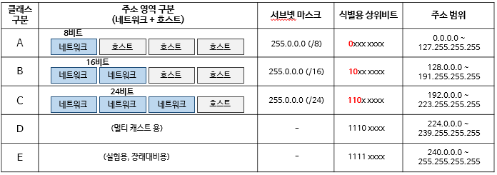

# IP 주소의 개요

### IPv4

- 인터넷  초창기부터 사용해온 주소 체계
- 현재까지 사용
- 이용자와 장치 수가 급증하면서 주소 부족 문제 발생

### IPv6

- IPv4의 주소 부족 문제를 해결하기 위해 도입
- 많은 주소를 제공하지만 구조가 복잡

### IPv4주소의 구조

- `.` 으로 구분된 네 부분으로 구성
- 각각 `0~255`까지의 숫자가 들어가며, 2진수로 `0000 0000` ~ `1111 1111`
- 총 32비트로 구성 → 약 43억 개의 주소 할당

### IPv4 주소의 클래스

- 단순히 컴퓨터 한 대 한 대를 식별하는 것 외 네트워크 전체도 식별
- 주소의 전체 4바이트중 일부는 네트워크를 식별하는 네트워크 부분
- 나머지는 그 네트워크에 연결된 특정 장치를 식별하는 호스트 부분
- 클래스: IP 주소를 용도와 규모에 따라 구분하는 주소 분류 방식
    - 클래스 A
        - 네트워크 부분 1바이트
        - 호스트 부분 3바이트
        - 하나의 네트워크에 많은 호스트 장치 연결 가능
    - 클래스 B
        - 네트워크 부분 2바이트
        - 호스트 부분 2바이트
        - 클래스 A와 C의 중간 규머의 네트워크에 사용하기 적합
    - 클래스 C
        - 네트워크 부분 3바이트
        - 호스트 부분 1바이트
        - 작은 규모의 네트워크에 사용
- 네트워크 주소는 해당 IP 주소가 어떤 네트워크에 속하는지 표시
- 호스트 주소는 해당 네트워크에 연결된 개별 장치 표시
- IP 주소의 맨 앞 비트가 어떤 패턴을 가지느냐에 따라 클래스 구분
- `A→0`, `B→10`, `C→110`

### 클래스 A 네트워크

- 가장 큰 규모의 네트워크를 지원
- 네트워크 주소 `1~126`까지 사용
- 맨 앞 비트가 0으로 고정되므로 7비트만 사용
- 7비트로 표현할 수 있는 숫자 범위 → `0~127` (처음 `0(000 0000)`, 마지막 `127(111 1111)` 제외)
- 초대형 기업이나 정부 기관에서 주로 사용
- ex) 미국 AT&T

### 클래스 B 네트워크

- 첫 바이트의 주소 범위 `128~191`(`10 00 0000` ~ `10 11 1111`)
- 나머지 바이트 `0~255`
- ex) kt, skt, 대학교

### 클래스 C 네트워크

- 첫 바이트 주소 범위 `192~223`(`110 0 0000` ~ `110 1 1111`)
- 나버지 바이트 `0~255`
- ex) 작은 기업, 가정

### 루프백 주소

- 첫 바이트가 `127`(`0111 1111`)로 시작, 자기 자신을 지칭
- `127.0.0.0 ~ 127.255.255.255` 클래스의 종류 상관없이 루프백 주소
- 컴퓨터 내부에서 네트워크가 제대로 연결되었는지 확인
- **localhost**
    - `127.0.0.1`
    - IETF의 RFC 문서에서 루프백 통신의 기본 주소로 공식 지정