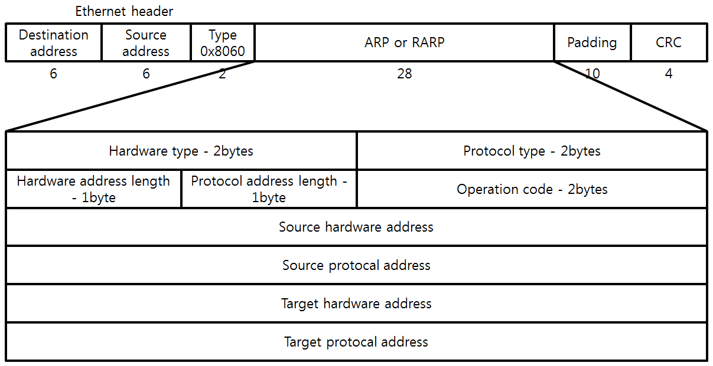

# LAN에서 WAN으로 진입하기

### ARP의 개념

- MAC 주소를 알아내는 프로토콜
- 원하는 장치의 MAC 주소를 묻는 브로드캐스트 메시지를 LAN 내 모든 장치에 보내 해당 장치로부터 직접 MAC 주소를 회신받을 수 있음

### APR 패킷

- APR 요청 패킷
- APR 응답 패킷
- 하드웨어 타입
    - ARP가 사용하는 하드웨어 타입
    - 2바이트 구성
- 프로토콜 타입
    - ARP가 사용하는 IP 버전
    - 2바이트 구성

- 하드웨어 길이: MAC 주소의 길이를 바이트 단위로 나타내며 1바이트로 구성, MAC 주소가 6바이트이기 때문에  항상 6(0000 0110)
- 프로토콜 길이: IP 주소의 길이를  바이트 단위로 나타내며 1바이트로 구성, IPv4와 IPv6 중에서 IPv4를 사용할 경우 4(0000 0100)
- OP코드: ARP 패킷이 어떤 동작을 하는지 나타내며, 1바이트로 구성, MAC 주소를 물어보는 ARP 요청 패킷이면 1(0x0001), MAC 주소를 회신하는 ARP 응답 패킷이면 2(0x0002)
- 출발지 MAC 주소: ARP