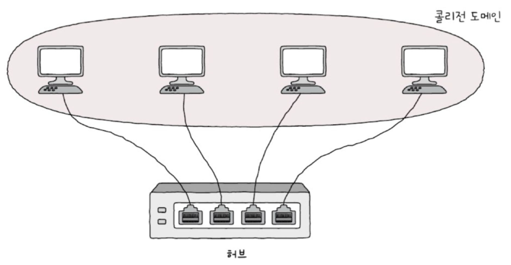

# LAN의 개요

### LAN의 개념

- LAN: 가까운 지역을 연결하는 근거리 통신망
- 유선 LAN
    - 케이블을 이용해 연결
    - 안정적인 속도 제공, 이동성 제약
- 무선 LAN
    - 전기파를 이용해 데이터 전송
    - 자유롭게 이동하며 사용가능
    - 유선 LAN보다 복잡
    - ex) 와이파이

### LAN의 시작

- 0과 1은 전압차이로 구분
- 허브
    - 컴퓨터 여러 대를 연결하는 장치
    - 스위치가 등장하기 전까지 활발히 사용
- 다중 포트 리피터
    - 다중 포트: 포트가 여러 개
    - 리피터: 신호를 증폭하거나 재생성하는 장치

### 허브의 문제

- 데이터 브로드캐스팅
    - 신호를 증폭하거나 재생성하는 장치라 데이터를 받으면 네트워크에 연결된 모든 컴퓨터를 보내 원하지 않는 컴퓨터까지 데이터를 받게 됨
    - 네트워크 트래픽이 증가해 전체 속도가 느려지고 보안에 취약
- 데이터 충돌
    - 여러 컴퓨터가 동시에 데이터를 전송하려고 해서 네트워크상에서 충돌이 많이 일어남
    - 데이터 손상, 속도 저하, 네트워크 마비 문제 발생

### 데이터 충돌 문제 해결: CSMA/CD

- 콜리전 도메인
    - 콜리전: 충돌/도메인: 영역
    - 네트워크 상에서 데이터 충돌이 발생할 수 있는 영역
- 허브에 연결된 모든 컴퓨터는 하나의 콜리전 도메인 형성
- 스위치
    - 각 포트를 별도의 콜리전 도메인으로 분리
    - 브로트캐스팅하지 않고 바로 목적지와 연결된 컴퓨터에 전송
- CSMA/CD
    - 반송파 감지 다중 접속 및 충돌 탐지
    - 충돌이 발생했을 때 이를 감지하고 처리하는 방법
    - **반송파감지**: 출발지 컴퓨터에서 데이터를 전송하기 전에 다른 컴퓨터에서 전송 중인 데이터가 있는지 확인
    - **다중 접속**: 네트워크가 사용 중인지 확인하고, 네트워크가 비어 있다면 데이터를 전송
    - **충돌 탐지**: 다중 접속을 허용하기 때문에 두 컴퓨터가 동시에 네트워크가 비어 있다고 판단하고 데이터를 전송할 수 있음. 출발지 컴퓨터는 데이터를 전송하는 도중에 다른 컴퓨터에서 보낸 데이터와 충돌이 발생하지 않는지 감지하고 있다가 충돌이 발생하면 데이터 전송을 중단하고 임의의 시간동안 기다렸다가 잠시 후에 다시 전송
- 더미 데이터
    - 네트워크가 비어 있는지 확인하기 위해 보내는 의미없는 비트 패턴 데이터
- 스위치가 보편화되면서 CSMA/CD의 중요성 감소

### 데이터 브로드캐스팅 문제 해결: MAC 주소

- 브로드캐스트 도메인
    - 하나의 네트워크에서 브로드캐스드 메시지가 도달할 수 있는 범위
    - 동일한 허브 또는 스위치에 연결된 네트워크
- 라우터
    - 서로 다른 네트워크를 연결하는 장비
    - 각 네트워크는 별도의 브로드캐스트 도메인이므로 서로 브로드캐스트 메시지를 주고받을 수 없음
- 물리적 주소
- 네트워크에 연결된 모든 장치에 부여된 고유한 식별자
- 브로트캐스트를 해결하기 위해 출발지 컴퓨터의 MAC 주소와 목적지 컴퓨터의 MAC주소를 함께 넣어 보냄

### MAC 주소의 개념

- 네트워크에 연결된 장치가 통신 매체에 접근해 데이터를 주고받을 때 어떤 방식으로 동작할지를 제어한다는 의미
- 네트워크 인터페이스 카드에 새겨진 고유한 물리적 주소
- 한 장치에 MAC 주소는 여러 개일 수 있음
- 16진수로 구성, 6바이트

