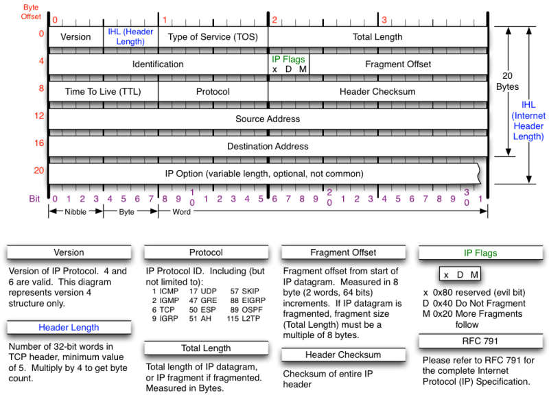

# TCP

### TCP의 개념

- **IP 프로토콜의 단점**
    - IP 패킷이 목적지에 제대로 도착했는지 보장X
    - IP 프로토콜은 단순히 IP 패킷을 전송하는 역할
    - 패킷 손상, 유실 미확인 → 신뢰할 수 없는 프로토콜
- **TCP**
    - IP의 한계를 보완하고 신뢰성 있는 데이터 전송을 보장하는 프로토콜
    - **연결 지향**
        - 애플리케이션 간 통신이 시작되기 전 TCP 연결을 설정하고 통신이 끝날 때까지 이 연결의 유지한다는 의미
        - 소켓 이용
        - **소켓**: 두 애플리케이션 간에 연결된 가상 파이프
        - 데이터는 이 파이프를 통해 안정적으로 양방향 통신
        - 데이터를 전송한 후 반드시 응답을 받아 데이터가 잘 도착했는지 확인
        - 응답이 없거나 오류 발생 시 데이터 전송

### TCP 세그먼트

- **세그먼트**
    - TCP의 데이터 전송 단위
    - IP 패킷의 데이터 필드에 담아 전송
    - 3계층 세그먼트 → 2계층 IP 패킷 → 1계층 프레임
- IP 패킷의 프로토콜 필드 → 어떤 프로토콜을 사용하는지 표시, 데이터 필드에 TCP 세그먼트가 들어갈 경우 6

- TCP 세그먼트는 헤더와 데이터로 구성
- TCP 헤더는 기본적으로 20바이트, 옵션 필드가 있으면 증가

- **출발지 포트**: 출발지 컴퓨터의 애플리케이션 포트 번호, 2바이트로 구성
- **목적지 포트**: 목적지 컴퓨터의 애플리케이션 포트 번호, 2바이트로 구성
- **시퀀스 번호**
    - 세그먼트의 순서 관리, 4바이트로 구성
    - TCP는 응용 계층으로부터 받은 데이터가 클 경우 여러 세그먼트로 나눠 시퀀스 번호를 붙임
    - 전송 데이터의 바이트 스트림에서 각 바이트가 몇 번째인가
    - 1바이트마다 시퀀스 번호가 1씩 증가
    - 목적지 컴퓨터는 세그먼트들이 순서대로 도착하지 않았을 때 시퀀스 번호를 보고 원래 순서대로 재조립
- **ACK 번호**
    - 목적지 컴퓨터에서 다음에 받기를 기대하는 세그먼트의 시퀀스 번호
    - 4바이트로 구성
    - 출발지 컴퓨터는 앞서 보낸 데이터가 제대로 전송되었는지 확인 가능
- **헤더 길이**: 4바이트 단위, 4비트 구성 최대 16바이트까지 표현
- **예약**: 예약된 비트, 사용하지 않기 때문에 0, 6비트
- **플래그**
    - TCP 연결 설정, 종료, 데이터 전송 상태 등을 나타내는 6개의 플래그
    - 각 플래그는 1비트씩 총 6비트로 구성
    - 플래그가 1로 설정되면 해당 플래그 활성화
    - 플래그는 단독 사용 & 동시 설정

- **윈도우 크기**
    - 출발지 컴퓨터와 목적지 컴퓨터 간에 한번에 전송할 수 있는 데이터의 크기 지정
    - 2바이트 구성
    - 작은 크기 → 네트워크 상황에 따라 점차 크기 상승
- **체크섬**
    - TCP 세그먼트의 오류를 검출하기 위한 값
    - 2바이트 구성
- **긴급 포인터**
    - 긴급 데이터의 끝 위치 표시
    - 2바이트 구성
    - URG 를래그가 켜져 있을 때만 사용
- **옵션**
    - 선택 필드로 윈도우 크기 조정 등
    - 가변 길이
- **패딩**
    - TCP 헤더 길이를 4바이트 단위로 맞추기 위해 추가하는 비트
    - 가변 길이
- **데이터**
    - 전송할 데이터
    - 응용 계층으로부터 받은 데이터 들어감

### 통신 과정

- **클라이언트**
    - IP 주소: 192.168.100.1
    - 포트 번호: 운영체제로 부터 할당받은 50,708
    - 소켓: 192.168.100.1:50708
- **서버**
    - IP 주소: 192.168.10.1
    - 포트번호: 13
    - 소켓: 192.168.10.1:13
- **TCP 연결 설정**
    - 3-way handshake
    - **1단계: 클라이언트 → 서버: SYN**
        - **SYN**: 클라이언트가 서버로 TCP 연결 요청
        - **시퀀스 번호=0**: 클라이언트에서 서버로 데이터 전송 시 세그먼트 시작 번호(보통 무작위 설정)
        - **데이터=0바이트**: 전송 데이터 없음
    - **2단계: 서버 → 클라이언트: SYN+ACK**
        - **SYN+ACK**: 서버 → 클라이언트 연결 요청 동시에 1단계 요청 수락. TCP 세그먼트는 동시에 여러 플래그 활성화 가능
        - **시퀀스 번호=0**: 서버 → 클라이언트 데이터 전송 시 세그먼트 시작 번호
        - **ACK 번호=1**: 클라이언트로부터 받은 연결요청 세그먼트에는 데이터가 없지만 시퀀스 번호 하나 소비. 클라이언트와 서버의 시작 번호를 맞춤. SYN에 대한 ACK 번호는 클라이언트가 보낸 시퀀스 번호에 1을 더함. 다음에 받을 시퀀스 번호로 1을 기대한다는 의미
        - **데이터=0바이트**: 전송 데이터 없음
    - **3단계: 클라이언트 → 서버: ACK**
        - **ACK**: 서버의 연결 요청 수락
        - **시퀀스 번호=1**: 1단계에서 클라이언트가 보낸 SYN 세그먼트는 시퀀스 번호 하느를 소비. 다음 세그먼트의 시퀀스 번호를 1 증가
        - **ACK 번호=1**: 서버로부터 받음 SYN+ACK 세그먼트 역시 시퀀스 번호 하나 소비. 다음 세그먼트의 시퀀스 번호를 1 증가
        - **데이터=0바이트**: 전송 데이터 없음
- **데이터 전송 및 확인**
    - **4단계: 서버 → 클라이언트: 데이터 전송**
        - **ACK**: 데이터 전송 시에도 ACK 플래그 활성화
        - **시퀀스 번호=1**: 2단계에서 서버가 보낸 SYN+ACK는 시퀀스 번호를 하나 소비. 다음 세그먼트의 시퀀스 번호를 1 증가
        - **ACK 번호=1**: 3단계에서 클라이언트가 보낸 ACK 세그먼트는 시퀀스 번호 비소비. 데이터가 없는 ACK 세그먼트는 단순히 응답만 하기 때문.
        - **데이터=22**바이트: 22바이트 크기의 날짜와 시간 데이터 전송
    - **5단계: 클라이언트 → 서버: ACK**
        - **ACK**: 클라이언트는 데이트를 잘 받았다고 응답
        - **시퀀스 번호=1**: 3단계에서 클라이언트가 보낸 ACK 세그먼트는 데이터가 없는 순수 ACK 세그먼트
        - **ACK 번호=23**: 4단계에서 서버가 보낸 시퀀스 번호에 데이터의 크기를 더함.
        - **데이터=0바이트**: 전송 데이터 없음
- **재전송**
    - 중간 데이터 손실 시 목적지 컴퓨터는 ACK 번호를 증가시키지 않고 계속 같은 번호를 반복해서 전송
    - 출발지 컴퓨터는 중간 데이터가 빠졌다는 걸 알라채고 ACK 번호로 확인한 마지막 바이트 이후부터 다시 전송
    - TCP는 데이터 손실 외에도 중복 도착, 순서 바뀜 등을 확인하고 오류가 발생했을 때 재전송함으로써 통신의 신뢰성 보장
- **TCP 연결 종료**
    - **4-way handshake**
    - **6단계: 서버 → 클라이언트: FIN**
        - **FIN**: 서버는 더 이상 보낼 데이터가 없어 클라이언트에 연결 종료 요청
        - **시퀀스 번호=23**: 4단계에서 서버는 22바이트 데이터 전송. 다음 세그먼트의 시퀀스 번호는 이전 시퀀스 번호에 데이터 크기를 더함
        - **ACK 번호=1**: 5단계에서 클라이언트가 보낸 ACK 세그먼트는 시퀀스 번호 비소비. 서버는 클라이언트에 다음에 받길 원하는 시퀀스 번호, 즉 ACK 번호 유지
        - **데이터=0바이트**: 전송 데이터 없음
    - **7단계: 클라이언트 → 서버: ACK**
        - **ACK**: 서버의 연결 종료 요청 수락
        - **시퀀스 번호=1**: 5단계에서 클라이언트가 보낸 ACK 세그먼트는 데이터가 없는 순수 ACK 세그먼트. 시퀀스 번호는 증가하지 않고 1 유지
        - **ACK 번호=24**: 6단계에서 서버로부터 받은 FIN 세그먼트는 시퀀스 번호 하나 소비. 다음에 받기를 기대하는 시퀀스 번호는 이전 시퀀스 번호에 1을 더함.
        - **데이터=0바이트**: 전송 데이터 없음
    - **8단계: 클라이언트 → 서버: FIN**
        - **FIN**: 클라이언트도 더 이상 보낼 데티거다 없다면 연결 종료 요청
        - **시퀀스 번호=1**: 7단계에서 클라이언트가 보낸 ACK 세그먼트는 데이터가 없는 순수 ACK 세그먼트. 시퀀스 번호 유지
        - **ACK 번호=24**: 서버로부터 다음에 받기를 기대하는 시퀀스 번호 24 유지
        - **데이터=0바이트**: 전송 데이터 없음
    - **9단계: 서버 → 클라이언트: ACK**
        - **ACK**: 서버는 클라이언트의 요청 수락
        - **시퀀스 번호=24**: 6단계에서 서버는 시퀀스 번호 하나 소비.
        - **ACK 번호=2**: 8단계에서 클라이언트가 보낸 FIN 세그먼트는 시퀀스 번호를 하나 소비.
        - **데이터=0바이트**: 전송 데이터 없음