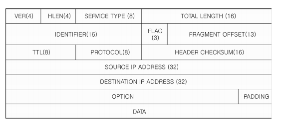

# UDP

### UDP의 개념

- **TCP**
    - 연결 지향형 프로토콜
    - 데이터 전송 전 두 컴퓨터 간 연결 설정
    - 데이터가 손실 없이 순서대로 잘 전달됐는지 확인
- **UDP**
    - 비연결형 프로토콜
    - 두 컴퓨터 간 연결 설정 과정 없이 데이터 전송
    - 데이터가 제대로 전달됐는지 확인하지 않기 때문에 UDP를 사용한 애플리케이션 간 통신을 불안전
    - 데이터 전송 속도 빠름
    - 데이터 일부가 손실되더라도 끊김 없이 빠르게 전송되는 것이 더 중요한 상황에 사용

### UDP 데이터그램

- **데이터그램**
    - UDP의 데이터 전송 단위
    - IP 패킷의 데이터 필드에 실려 전송
    
    
    

- **출발지 포트**: 출발지 컴퓨터의 애플리케이션의 포트 번호. 2바이트 구성
- **목적지 포트**: 목적지 컴퓨터의 애플리케이션의 포트 번호. 2바이트 구성
- **길이**: UDP 헤더와 데이터 전체 길이를 바이트 단위로 표현. 2바이트 구성
- **체크섬**: UDP 데이터그램의 오류를 검출하기 위한 값. 2바이트 구성
- **데이터**: 응용 계층으로부터 받은 실제 전송할 데이터

### UDP 통신 과정

- 출발지 컴퓨터는 상대방의 IP 주소와 포트 번호만 알아낸 후 바로 데이터 전송
- 목적지 컴퓨터 역시 독립적으로 데이터 전송
- 연결 설정 없이 바로바로 통신

