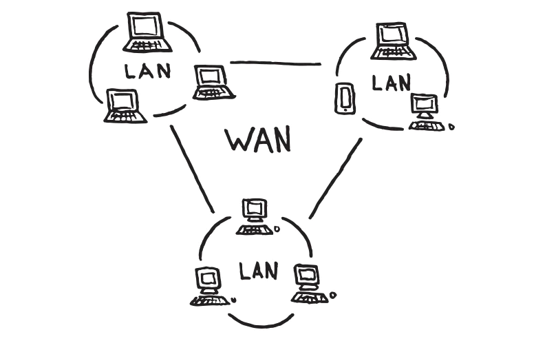

# WAN의 개요

### WAN의 개념

- 여러 LAN을 연결해 만든 거대한 통신망
- 광역 통신망

### 라우터

- 멀리 떨어져있는 LAN을 연결하고 데이터를 전송하는 장치
- 서로 다른 LAN을 연결해 더 큰 네트워크 구축
- 라우팅
    - 라우터들이 서로 통신하며 최적의 경로를 찾는 과정
    - 라우팅 프로토콜
        - 데이터가 목적지 컴퓨터까지 도달하기 위한 최적의 경로를 찾는  통신규칙을 적용한 방식
    - 스태틱 라우팅
        - 네트워크 관리자가 직접 네트워크 경로를 설정하는 방식
        - 네트워크 규모가 작고 네트워크 경로가 거의 바뀌지 않는 경우 유용
- 대부분의 WAN에서는 라우팅 프로토콜을 이용해 네트워크 운영

### 스위치와 라우터의 차이

- 사용하는 주소
    - **MAC 주소(스위치)**: 물리적 주소, LAN 내 장치들을 구분하고 데이터 전송시 사용
    - **IP 주소(라우터)**: WAN상의 모든 장치를 구분하기 위해 부여된 논리적 주소, `0~255` 범위의 숫자 4개
- 브로드캐스트 메시지 전송
    - 스위치는 LAN 내에서 브로트캐스트 메시지 전송, 라우터는 LAN 간에 브로드캐스트 메시지를 차단
    - 스위치로 연결된 LAN은 하나의 브로드캐스 도메인 구성
    - 라우터는 LAN별로 브로드캐스트 도메인을 분리, 네트워크 전체의 트래픽을 줄여 성능 향상
- 네트워크 모델의 동작 계층
    - 스위치는 OSI 7계층 모델에서는 데이터 계층, TCP/IP 모델에서는 네트워크 인터페이스 계층에서 동작
    - 라우터는 OSI 7계층 모델에서는 네트워크 계층, TCP/IP 모델에서는 인터넷 계층에서 동작
    - 허브는 물리, 네트워크 인터페이스 계층에서 동작