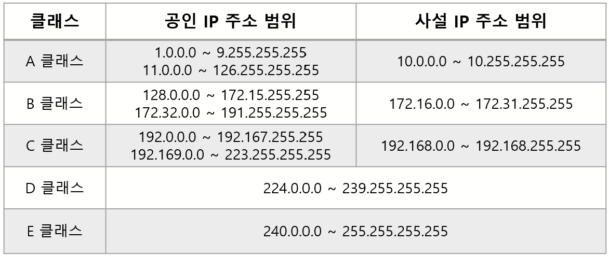

# 공인 IP 주소와 사설 IP 주소

### 공인 IP 주소와 사설 IP 주소의 개념

- **공인 IP**
    - 전 세계적으로 인터넷에 직접 연결할 수 있는 고유한 IP 주소
    - IANA에서 배정, 관리
    - 논리적인 위치 정보 포함 → 인터넷상에서 고유하게 식별 가능한 주소 정보로 사용
    - 1980년에 공개된 초기 인터넷 프로토콜 스펙을 정의한 REC 760문서에서 표준화한 후 1983년부터 인터넷에서 광범위하게 사용
- **사설 IP**
    - 인터넷에 직접 연결되지 않고 개인 네트워크에서만 사용하는 IP 주소
    - 중복 가능, IANA가 특정 범위를 사설용으로 예약
    - 위치 정보 불포함
    - 라우팅 불가능 → 인터넷 통신에서 사용 불가, 특정 LAN에서의 통신에만 사용
    - 1996년 IETF에서 발표한 RFC 1918문서에서 처음 소개 → 인터넷에 직접 연결되지 않고 내부 네트워크에서만 쓸 수 있는 목적으로 IP 주소 범위 지정

### 사설 IP 주소의 범위

- 클래스 A, B, C의 사설 IP 주소는 클래스별로 일부 범위 지정해 사용 → 1996년 IETF의 RFC 1918 문서에서 공식 지정
- IP 주소의 맨 앞자리가 10 → 클래스 A의 사설 IP 주소
- 172 → 클래스 B
- 192 → 클래스 C
- 클래스 B와 C는 두 번째 바이트의 주소까지 봐야 사설 IP 주소인지 확인 가능

- RFC 1918 문서에 정의된 세 가지 사설 IP 주소 범위
    - **10.0.0.0/8**: 전통적인 클래스 A 대역, 앞쪽 8비트가 네트워크 주소로 고정
    - **172.16.0.0/12**: 전통적인 클래스 B 대역처럼 보이지만 실제로는 `/12`  범위의 CIDR 기반 주소
    - **192.168.0.0/16**: 전통적인 클래스 C 대역처럼 보이지만 실제로는 `/16` 범위의 CIDR 기반 주소

### 네트워크 주소 변환

- **네트워크 주소 변환**
    - LAN 내에 장치가 인터넷으로 데이터를 전송하려면 사설 IP 주소를 공인 IP 주소로 변환
    - 기본 게이트웨이가 LAN에 있는 장치의 사설 IP 주소를 자신의 공인 IP 주소로 대체 하는 방식
    - LAN 내에 여러 장치가 하나의 공인 IP 주소를 공유하면서 인터넷에 접근 가능
    - 데이터가 되돌아올 때는 기본 게이트웨이가 공인 IP 주소를 LAN에 있는 장치의 원래 사설 IP 주소로 다시 변환
    - 결과적으로 사설 IP 주소와 공인 IP 주소를 함께 사용하면 IP 주소가 낭비되는 일을 막고 부족한 IP 주소를 효율적으로 사용 가능
    
    
    

### 사설 네트워크

- **사설 네트워크**
    - 내부 네트워크는 사설 IP 주소만으로도 충분히 구성 가능
    - 내부에서 인터넷이 바로 접근 불가 → 보안 유리
    - 발급 비용 X → 네트워크 구축 비용 절약
- **포트 포워딩**
    - 외부에서 사설 네트워크의 특정 장치에 접속할 수 있도록 기본 게이트웨이에 데이터의 목적지를 지정
- 사설 IP 주소 → 서브네팅을 통해 사용 가능한 네트워크 수 늘림 가능
- 소규모는 사용가능한 사설 IP 주소가 충분히 많기 때문에 굳이 서브네팅 하지 않음