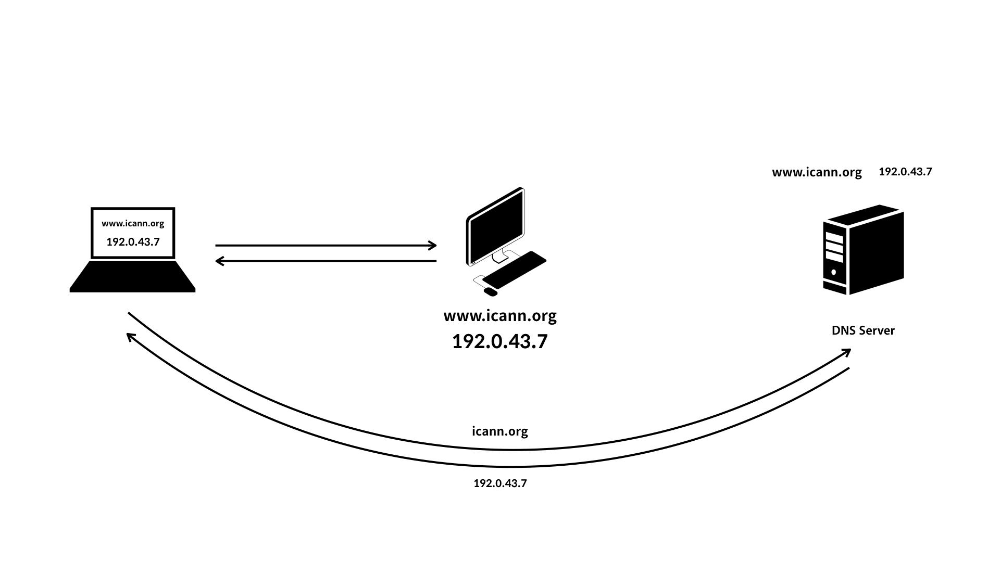

# 관리용 프로토콜

- 네트워크 장비나 서버의 상태를 모니터링하고 관리하기 위한 프로토콜

### DNS

- 도메인 이름을 IP 주소로 변환해주는 프로토콜
- 전송 계층의 UDP 53번 포트를 사용해 통신
- 응답 데이터 크기가 크거나 연결이 필요한 경우 → TCP 53번 포트 사용
- **도메인 이름**을 실제 네트워크에서 사용하는 숫자 형태의 IP 주소로 변환

- 사용자는 복잡한 IP 주소를 외울 필요없이 도메인 이름을 사용해 웹사이트에 접근 가능
- 서버 이전 등과 같은 인프라 변경에도 유연하게 대처
- IP 주소를 도메인 이름으로 변환하는 역방향 조회도 제공

### DHCP

- 네트워크에 연결된 장치에 IP 주소를 자동으로 할당해주는 프로토콜
- 전송 계층에서 UDP 사용
- 통신 시 DHCP 서버는 67번 포트, 클라이언트는 68번 포트 사용
- 네트워크 통신을 위해 서브넷 마스크, 기본 게이트웨이의 IP 주소, DNS 서버의 IP 주소까지 자동 설정
- 네트워크 관리자가 수많은 장치의 IP 주소 및 관련 설정을 수동으로 관리해야 하는 부담 저하

### NTP

- 네트워크에 연결된 장치가 NTP 서버와 통신해 서버의 시간과 정확하게 일치하도록 동기화하는 프로토콜
- 전송 계층의 UDP 123번 포트 사용
- 윈도우: 제어판 → 시계 및 국가 → 날짜 및 시간 → 인터넷 시간 탭에서 현재 사용 중인 NTP 서버 주소 확인 가능
- NTP 서버와 시간을 동기화 하는 이유
    - 네트워크상의 많은 애플리케이션과 각종 서비스는 정확한 시간 정보에 의존해 작동하는 경우 다수
    - 시간이 맞지 않으면 다양한 문제 발생
    - 특정 네트워크 서비스나 프로그램에 대한 접근 자체 불가능
- 분산된 네트워크 환경에서 모든 시스템이 일관되고 정확한 시간을 유지하도록 보장하는 NTP는 안정적인 시스템 운영과 서비스를 제공을 위한 필수 프로토콜

### SNMP

- 네트워크에 연결된 여러 장치를 체계적으로 모니터링하고 관리하는 데 사용하는 프로토콜
- 인프라를 관리하는 수많은 장치의 상태를 중앙에서 효과적으로 감시 및 관리 가능
- **관리 스테이션**: 네트워크 관리자가 다르눈 중앙 감지 시스템. NMS 설치
- **관리 대상 장치**: 관리해야 할 네트워크 장치. 에이전트 설치
- **NMS**
    - 관리 대상 장치의 **에이전트**와 통신해 해당 장치를 관리하는 데 필요한 정보를 얻거나 제어 명령
    - 네트워크 장치에 정보를 요정하거나 명령을 전달하는 클라이언트 역할 수행
    - 관리 대상 장치는 관리 스테이션의 요청에 응답하고 정보를 제공하는 서버 역할 수행
- 전송 계층의 UDP 사용
- 161번 포트를 사용해 요청과 응답
- **트랩**
    - 특정 이벤트가 발생하면 관리 스테이션에 자발적으로 보내는 경보 메시지
    - 관리 스테이션의 162번 포트 사용
- 네트워크 인프라의 가용성과 성능 유지를 위한 핵심 도구

### LDAP

- 네트워크에서 운영되는 디렉터리 서비스에 접근해 정보를 검색하거나 수정할 수 있게 해주는 프로토콜
- 전송 계층의 TCP 389번 포트 사용
- **디렉터리 서비스:** 네트워크로 연결된 조직 내 다양한 자원 정보를 계층적 구조로 저장하고 관리하는 중앙 집중식 데이터 베이스
- 디렉터리 서비스에 저장된 정보를 효율적으로 관리하고 빠르게 조회하도록 도움
- **LDAPS**
    - LDAP에 SSL/TLS 기술을 추가해 통신 데이터를 암호화해 전송하는 프로토콜
    - 전송 계층의 TCP 636번 포트 사용
    - **SSL**
        - 클라이언트와 서버 간에 보안 세션을 설정하고 데이터를 암호화하는 프로토콜
    - **TLS**
        - SSL의 후속 표준 프로토콜
        - SSL보다 보안과 성능이 개선된 버전
    - SSL과 TLS는 통신 데이터를 암호화해 제 3자가 도청하거나 위변조 하는 것 방지
    - 기본적인 역할은 같지만 세부적인 암호화 알고리즘이나 작동 방식 차이
    
    
    

### SMB

- 원격으로 연결된 서버에 접속해 파일, 폴더, 프린터와 같은 자원을 사용할 수 있도록 해주는 프로토콜
- 윈도우 환경에서 주로 사용
- 내 컴퓨터 → 네트워크 드라이브 → Z:\공유폴더 접속 가능
- 전송 계층의 TCP 445번 포트 사용
- LDAP → 디렉터리 서비스에 접근해 사용자 정보나 공유 자원 위치 정보를 찾는 데 사용
- SMB → 그 정보를 바탕으로 실제 공유된 파일에 접근해 읽고 쓰거나 공유 프린터로 인쇄 작업을 보내는 등 공유 자원을 실제로 이용하는 데 사용
- 과거 마이크로소프트 윈도우와 밀접한 관련 → 현재 다양한 운영체제에서 사용
- 기업에서 많이 사용하는 윈도우 서버의 액티브 디렉터리 도메인 환경에서는 LDAP와 SMB를 긴밀하게 연동해 핵심적인 네트워크 서비스 제공

### 정리

| **이름** | **설명** | **전송 계층** | **포트 번호** |
| --- | --- | --- | --- |
| DNS | 도메인 이름을 IP 주소 또는 그 반대로 변환 | UDP/TCP | 53번 서버 |
| DHCP | IP 주소 등의 네트워크 설정을 자동으로 할당 | UDP | 67번 서버
68번 클라이언트 |
| NTP | 네트워크 장치를 서버 시간으로 동기화 | UDP | 123번 서버 |
| SNMP | 네트워크 장비의 상태를 모니터링하고 관리 | UDP | 161번 서버/클라이언트
162번 클라이언트/트랩 |
| LDAP | 디렉터리 서비스에 접근해 정보 검색 | TCP | 389번 서버 |
| SMB | 윈도우 환경에서 파일/프린터 등 공유 | TCP | 445번 서버 |