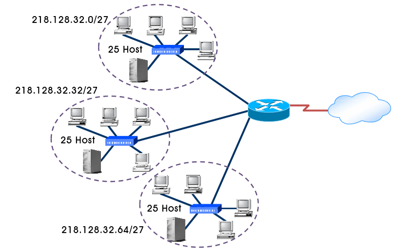

# 서브네팅

### 서브네팅의 개념

- 모든 장치가 하나의 네트워크로 연결
    - 보안 취약
    - 브로드캐스트 도메인 확장 → 네트워크 트래픽 증가 → 네트워크 성능 저하
- **서브네팅**
    - 하나의 네트워크를 여러 개의 작은 네트워크로 분할 하는 기술
    - 호스트 부분을 빌려 네트워크 부분으로 확장
- **장점**
    - **보안 강화:** 하나의 네트워크를 분리해 각각 쪼개진 네트워크에 대해 접근 권한 제한
    - **네트워크 성능 향상**: 브로드캐스트 도메인 사이즈 축소
    - **IP 주소 낭비 개선**: 네트워크 효율적 관리
    - **네트워크 문제 해결 용이**: 네트워크 문제가 발생했을 때 문제의 범위 축소→윈인 파악 수월

### 서브네팅의 원리

- **서브넷**
    - 하나의 클래스 C 네트워크를 분할해 n개로 나눔
    - 분리한 네트워크

### 서브네팅의 범위

- 클래스 C로 가정
    - 호스트 자리에서 1비트를 빌려오면 네트워크를 $2^1$로 분할
    - 호스트 자리에서 2비트를 빌려오면 네트워크를 $2^2$로 분할
    - 같은 방식으로 최대 6비트까지 가능
    - 최소 2비트는 호스트 부분으로 남겨야 함
    - 네트워크 주소와 브로드캐스트 주소가 또 따로 있기 때문

| **구분** | **호스트에서 빌려올 수 있는 최대 비트 수** | **최대 서브넷 수** |
| --- | --- | --- |
| 클래스 A | 22 | 4,194,304개 |
| 클래스 B | 14 | 16,384개 |
| 클래스 C | 6 | 64개 $2^6$ |