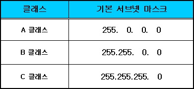

# 서브넷 마스크

### 서브넷 마스크의 개념

- 서브넷 마스크
    - IP 주소에서 네트워크 부분과 호스트 부분을 구분하는 데 사용하는 32비트 숫자
    - 앞쪽에 연속된 1의 개수에 따라 네트워크 부분과 호스트 부분 구분
    
    
    
- 클래스 A,B,C로 나누는 방식: 구성할 수 있는 네트워크의 규모가 고정되어 있어 비효율적
- 효율적인 네트워크를 구성하기 위해 서브넷 마스크 사용, 서브네팅

### 윈도우에서 IP 주소, 서브넷 마스크 확인하기

- `cmd`에서 `ipconfig` 입력
- **IPv4 주소**: 현재 컴퓨터에 할당된 IP 주소
- **서브넷 마스크**
    - 서브네팅 기술 적용(255.255.240.0)
    - 2진수 → `1111 1111. 1111 1111.1111 0000.0000 0000`
        - 1로 표현한 부분→네트워크 부분
        - 0으로 표현한 부분→호스트 부분
    - 네트워크 주소와 브로드캐스트 주소를 제외 하고 호스트에 할당 가능
        - **네트워크 주소**: 네트워크 자체를 식별, 호스트 부분의 모든 비트가 0
        - **브로드캐스트 주소**: 네트워크 내 모든 호스트에 메시지를 전송하는 데 사용, 호스트 부분의 모든 비트가 0
- **기본 게이트웨이**
    - WAN으로 나가는 관문 역할을 하는 라우터의 IP 주소

### 맥 OS에서 IP 주소, 서브넷 마스크 확인하기

- 터미널(`command+space`)에서 `ifconfig` 입력
- **en0**
    - 이더넷 인터페이스
    - 무선 LAN의 경우 와이파이 연결 정보를 포함 하기도 함
- **inet:** IPv4 주소
- **netmask**
    - 서브넷 마스크를 16진수로 표현
    - 역시 네트워크 주소와 브로드캐스트 주소를 제외하고 호스트에 할당
- **broadcast**: 호스트 주소의 모든 비트가 1

### CIDR 표기법

- **CIDR 표기법**
    - **슬래시 표기법**
    - 네트워크 부분을 나타내는 1이 몇 개인지를 숫자로 표시 하는 방법
    - ex) `255.0.0.0`→`/8`
- IP 주소와 CIDR 표기법 동시 사용 → ‘IP 주소/네트워크 비트수’
- ex)`20.10.3.4/8`
- 클래스 구분법에 머무르지 않고 네트워크 부분을 지정해 더욱 유연하게 구성
- 사용가능 숫자 범위 `/8~/30`
- `/31`
    - 호스트 부분을 나타내는 0이 하나만 있으므로 두 개의 호스트 IP 주소 생성
    - 네트워크 주소와 브로드캐스트 주소로 예약된 주소를 빼면 호스트에 할당할 주소 없음
    - 예외적으로, point to point 링크와 같이 두 장치만 연결하는 경우에 사용
- `/32`
    - 이론적으로 가능 실제 사용X
    - 서브넷 마스크의 모든 비트가 1 → 전체가 네트워크 부분, 호스트 부분 없음
    - 호스트 부분이 없다면 해당 네트워크에는 오직 하나의 장치만 존재할 수 있으므로 네트워크 통신 불가