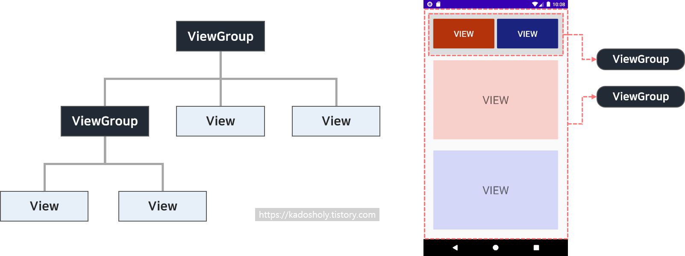

# UI 구성과 레이아웃

### 1. 안드로이드 UI 구성의 기본: View와 ViewGroup

안드로이드의 화면은 눈에 보이는 요소와 이들을 담는 틀의 계층 구조로 이루어짐

- **View 클래스**
    - 안드로이드 화면에서 실제로 사용되는 모든 시각적 요소들의 최상위 부모 클래스
    - 흔히 '위젯(Widget)'이라고 부르며, 버튼(`Button`), 텍스트뷰(`TextView`), 에디트텍스트(`EditText`), 이미지뷰(`ImageView`) 등이 모두 View 클래스의 서브클래스
- **ViewGroup 클래스**
    - 다른 위젯(View)들을 내부에 담아서 배치하고 정렬하는 '틀' 역할을 하는 특별한 위젯
    - **레이아웃(Layout)**: ViewGroup 클래스로부터 상속받은 변형 위젯들
    - 레이아웃 역시 크게 보면 뷰(View)의 하위 클래스이므로 View의 XML 속성과 메소드 모두 사용가능

### 2. 레이아웃의 대표적인 공통 속성

레이아웃 내부의 위젯들을 정렬하고 배치할 때 자주 사용하는 XML 속성들

- **`orientation`**: 레이아웃 안에 배치할 위젯들을 수직(`vertical`)으로 쌓을지, 수평(`horizontal`)으로 나열할지 방향 설정
- **`gravity`**: 레이아웃 내부에 있는 위젯들을 좌측, 우측, 중앙 등 어느 방향으로 정렬할지 결정
- **`padding`**: 레이아웃 내부의 테두리와 안에 배치된 위젯 사이의 안쪽 여백 설정
- **`layout_weight`**: 레이아웃이 전체 화면에서 차지하는 공간의 가중값(비율) 설정. 여러 개의 위젯이나 레이아웃 비율을 균등하게 나눌 때 유용.

### 3. 주요 레이아웃의 종류와 특징

안드로이드 화면을 디자인할 때 목적에 맞게 선택하는 핵심 레이아웃들

1. **리니어 레이아웃(LinearLayout)**
    1. 위젯들을 선형으로 차례대로 배치하는 가장 단순하고 직관적인 레이아웃
    2. `android:orientation` 속성을 지정하지 않으면 기본적으로 가로(`horizontal`)로 배치. 세로로 쌓고 싶다면 반드시 `vertical`을 명시
2. **상대 레이아웃 (RelativeLayout)**
    1. 위젯을 다른 위젯과의 상대적인 위치 관계나 부모 레이아웃과의 관계를 기준으로 배치
    2. "A 버튼의 오른쪽 아래에 배치해라", "부모 레이아웃의 중앙 오른쪽에 붙여라"와 같은 방식으로 정교한 배치 가능
3. **테이블 레이아웃 (TableLayout)**
    1. 위젯을 표(Row와 Column) 형태로 배열할 때 사용
    2. `<TableRow>` 태그를 이용해 행을 추가하고, 그 내부에 위젯을 넣어 열을 구성. 숫자 패드가 들어가는 계산기나 키패드 화면을 만들 때 주로 사
4. **그리드 레이아웃 (GridLayout)**
    1. 테이블 레이아웃과 유사하게 표 형태로 위젯을 배치하지만, 훨씬 직관적이고 유연
    2. 행 확장(`layout_rowSpan`)이나 열 확장(`layout_columnSpan`)을 간단하게 지정할 수 있어서 유연하고 복잡한 화면 구성에 적합

