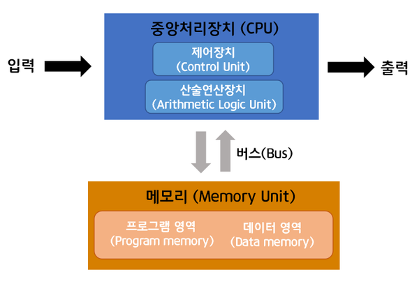

# 컴퓨터의 주요 구성 요소

### 폰 노이만 구조

- **폰 노이만 구조**
    - 현대 대부분의 컴퓨터의 기반
    - 수학자 존 폰 노이만이 제안, 컴퓨터가 데이터를 처리하는 기본 원리 설명
    - **핵심 원리**
        - CPU가 메모리에 저장된 프로그램과 데이터를 순차적으로 처리
        - 프로그램과 데이터는 동일한 메모리 공간에 저장
        - 데이터와 명령어는 버스를 통해 CPU와 메모리 사이에서 이동
    - **구성**
        - **중앙 처리 장치**: 모든 연산을 담당하는 컴퓨터의 두뇌 역할. 메모리에서 명령어를 가져와 실행한 후 결과를 저장
        - **메모리**: 실행 중인 프로그램과 데이터를 저장하는 공간. CPU가 데이터에 빠르게 접근해 연산할 수 있도록 도움
        - **버스**: CPU와 메모리 사이에서 데이터와 명령어를 전달하는 통로
        - **입출력 장치**: 키보드, 마우스, 모니터, 프린터 등 외부 장치. CPU와 데이터를 주고받아 사용자가 조작할 수 있도록 연결
        
        
        
- 폰 노이만 구조는 CPU가 메모리에 직접 연결
- 비교적 간단해서 설계와 운영이 효율적
- 프로그램과 데이터가 같은 메모리에 저장되기 때문에 실행 중인 프로그램을 쉽게 수정하거나 업데이트할 수 있고, 소프트웨어 개발과 유지 보수가 간편
- 프로그램을 메모리에 저장하면 언제든지 실행할 수 있어 다양한 작업에 유연하게 대응
- CPU 처리 속도에 비해 메모리 접근 속도가 느리기 대문에 프로그램의 명령어와 데이터를 메모리에서 가져와는 데 시간 소요
- CPU의 처리 속도가 제한되는 **폰 노이만 병목 현상** 발생
- 명령을 순차적으로 실행하는 구조라서 여러 프로세서를 동시에 사용하는 병렬 처리 어려움

### 현대 컴퓨터 구조

- **CPU**
    - 명령어를 해석하는 컴퓨터의 핵심 장치
    - **산술 논리 장치**
        - 컴퓨터가 데이터를 처리하고 계산할 수 있도록 도와주는 장치
        - 산술 연산, 논리 연산, 비교 연산 등을 수행
        - ALU는 데이터와 제어 신호를 입력으로 받아 연산을 수행, 결과와 상태 플래그 출력
        - 연산 결과는 레지스터나 메모리에 저장
        - 현대 CPU는 ALU를 여러 개 포함해 성능을 높이고 연산을 동시에 처리해 속도를 향상
    - **제어 장치**
        - CPU가 프로그램의 명령어를 올바르게 실행하도록 돕는 역할
        - 메모리에 저장된 명령어를 읽어와서 어떤 작업을 수행해야 하는지 결정하고, ALU에 지시
        - 주변 장치에도 제어 신호를 보내 각 장치가 제대로 작동하도록 함
    - **레지스터**
        - CPU 내부에 있는 초고속 저장 장치
        - CPU가 처리할 데이터나 명령어를 임시로 저장하는 데 사용
        - **주요 역할**
            - 연산을 위한 데이터나 결과를 임시로 저장
            - 현재 실행 중인 명령어를 저장해 CPU가 빠르게 해석하고 실행할 수 있도록 함
            - 메모리에서 데이터를 가져올 때 메모리 주소를 저장하고 참조
        - CPU의 속도와 성능에 큰 영향
        - 메모리보다 훨씬 빠르게 데이터 처리
        - CPU에는 범용 레지스터, 프로그램 카운터, 스택 포인터 등 다양한 종류의 레지스터 존재
    - **메모리**
        - 포괄적으로 컴퓨터에서 데이터를 저장하는 장치
        - 일반적으로 **주 기억 장치**를 의미
        - 주 기억 장치는 CPU가 직접 접근할 수 있는 메모리, 프로그램이 실행될 때 데이터를 일시적으로 저장하는 공간
        - 속도가 빠르지만 전원이 꺼지면 데이터가 사라지는 휘발성
        - **RAM**이 대표적인 주 기억 장치
        - 프로그램을 실행하면 보조 기억 장치 등에서 데이터를 불러와 RAM에 저장
        - CPU가 프로그램을 실행하는 데 필요한 데이터를 RAM에서 읽고 연산을 수행
        - 결과를 다시 RAM 또는 보조 기억 장치에 저장
    - **보조 기억 장치**
        - 데이터를 영구적으로 저장하는 장치
        - CPU가 직접 접근하는 주 기억 장치와 대비
        - HDD, SSD, USB, 외장하드 등
        - **역할**
            - 데이터 영구 저장하기
            - 메모리에 데이터 로드하기
            - 데이터 백업 및 복구하기
            - 가상 메모리로 활용하기
    - **입출력 장치**
        - 컴퓨터가 외부와 소통할 수 있게 도와주는 장치
        - **주요 역할**
            - 입력 장치로 데이터 받기
            - 출력 장치로 결과 전달하기
            - 사용자 인터페이스 제공하기
            - 외부 장치와 데이터 교환하기
    - **버스**
        - CPU, 메모리, 입출력 장치 간 데이터, 주소, 제어 신호를 주고 받을 수 있는 통로
        - 컴퓨터 내부에서 **데이터를 전달하는 도로** 역할
        - **주요 역할**
            - CPU와 다른 장치 간 데이터 전송하기
            - 명령어 및 주소 전송하기
            - 제어 신호 전달하기