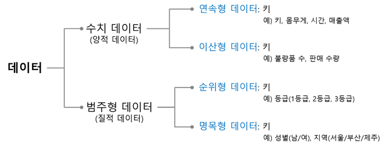

# 데이터란

- **데이터**
    - 컴퓨터가 처리할 수 있는 모든 종류의 정보
    - 컴퓨터는 문자, 숫자, 그림 등 다양한 형태의 데이터 처리 가능
    - 기본적으로 0과 1로 이루어진 이진수로 표현

### 데이터 단위

- **비트(binary digit)**
    - 컴퓨터에서 데이터를 표현하는 가장 작은 단위
    - 이진수를 사용해 표현
    - 0과 1의 두 상태
    - 참(1), 거짓(0)과 같은 불(boolean) 값을 나타내는 데도 사용
- **니블(nibble)**
    - 비트 4개
    - $2^4$ $= 16$개의 다른 상태 표현 가능
    - 십육진수 한 자리와 직접적으로 대응
- **바이트(byte)**
    - 니블 2개, 8비트
    - $2^8 = 256$개의 다양한 상태 표현
    - 데이터 처리와 저장의 기본 단위로 사용
    - 파일 크기, 메모리 용량, 전송 속도 등 데이터 양을 나타내는 중요한 단위

### 데이터의 종류

- **수치 데이터**
    - 숫자로 표현되는 데이터
    - 산술 연산 가능
    - **정수**
        - 소수점이 없는 수
        - 연속적이지 않고 구분되는 값을 가지는 이산형 데이터
        - 음의 정수, 양의 정수를 포함
        - 컴퓨터에서는 정수를 8비트, 16비트, 32비트 등 고정된 비트 수로 표현
    - **실수**
        - 소수점이 있는 수
        - 연속형 데이터
        - 부동 소수점 바아식으로 표현
        - 컴퓨터에서는 정밀도의 한계로 실수를 근사치로 표현하기 때문에 정확도가 떨어질 수 있음
        - 0.1과 같은 수는 이진수로 정확하게 표현할 수 없어서 근사값으로 저장
- **비수치 데이터**
    - 숫자로 표현되지 않는 데이터
    - 산술 연산 불가능
    - **문자 및 기호**
        - 알파벳, 한글, 숫자, 특수 기호 등으로 구성된 텍스트 데이터
        - ex) 안녕하세요!
    - **멀티미디어**
        - 이미지, 오디오, 비디오 등 다양한 형태의 미디어 데이터
        - 특정 코드나 형식을 사용해 표현
    - 주로 테스트 파일, 이미지 파일, 비디오 파일 등으로 저장되며, 각 데이터의 표현 방식은 특정한 규칙이나 표준에 따라 다름