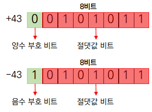

# 데이터를 표현하는 방법

- 사람은 문자나 숫자 등으로 데이터를 표현하지만 컴퓨터는 오직 이진수만 사용
- 사람이 이해하는 문자, 숫자, 기호 등을 컴퓨터 내부에서는 0과 1로 구성된 **이진코드**로 변환해 사용

### 이진수와 십육진수

- **이진수**
    - 이진법으로 나타낸 수
    - 0과 1만 사용해 숫자를 표기하는 방법
    - 컴퓨터는 데이터를 처리할 때 이진법을 사용하고 사람은 일상에서 십진법 사용
    - 각 진법은 숫자를 표현하는 데 사용하는 기본 수, 즉 기수에 기반
    - **기수**
        - 각 자릿수가 나타내는 값의 기준
        - 진법에 사용되는 숫자의 개수
        - 이진수는 0,1로 이루여져 기수가 2
        - 십진수는 0부터 9까지 10개의 숫자를 사용하므로 기수가 10
- **십진수를 n진수로 변환하는 방법**
    - **정수 부분**: 몫이 0이 될 때까지 기수(n)로 나눈 나머지를 거꾸로 작성
    - **소수 부분**: 0이 될 때까지 각 진법의 기수를 곱해 나온 정수를 순서대로 작성
- n진수를 십진수로 변환할 때는 각 자릿수에 해당하는 기수(n)의 거듭제곱 값을 곱한 후 모두 더함

| **십진수** | **십진수 → 이진수 변환** | **이진수** | **이진수 → 십진수 변환** |
| --- | --- | --- | --- |
| 2 | 2 / 2 = 1 나머지 0
1 / 2 = 0 나머지 1 | 10 | $1*2^1+0*2^0 = 2+0 = 2$ |
| 3 | 3 / 2 = 1 나머지 1
1 / 2 = 0 나머지 1 | 11 | $1*2^1+1*2^0 = 2 + 1 = 3$ |
| 4 | 4 / 2 = 2 나머지 0
2 / 2 = 1 나머지 0
1 / 2 = 0 나머지 1 | 100 | $1*2^2 +0*2^1 + 0*2^0 = 4+0+0= 4$  |
| 5 | 5 / 2 = 2 나머지 1
2 / 2 = 1 나머지 0
1 / 2 = 0 나머지 1 | 101 | $1*2^2 + 0*2^1 + 1*2^0 = 4+0+1 = 5$ |
| 6 | 6 / 2 = 3 나머지 0
3 / 2 = 1 나머지 1
1 / 2 = 0 나머지 1 | 110 | $1*2^2 + 1*2^1 + 0*2^0 = 4+2+0 = 6$ |
| 7 | 7 / 2 = 3 나머지 1
3 / 2 = 1 나머지 1
1 / 2 = 0 나머지 1 | 111 | $1*2^2 + 1*2^1 + 1*2^0 = 4+2+1 = 7$ |
| 8 | 8 / 2 = 4 나머지 0
4 / 2 = 2 나머지 0
2 / 2 = 1 나머지 0
1 / 2 = 0 나머지 1 | 1000 | $1*2^3+0*2^2+0*2^1 + 0*2^0 = 8+0+0+0 = 8$ |
| 9 | 9 / 2 = 4 나머지 1
4 / 2 = 2 나머지 0
2 / 2 = 1 나머지 0
1 / 2 = 0 나머지 1 | 1001 | $1*2^3+0*2^2+0*2^1 + 1*2^0 = 8+0+0+1 = 9$ |
| 10 | 10 / 2 = 5 나머지 0
5 / 2 = 2 나머지 1
2 / 2 = 1 나머지 0
1 / 2 = 0 나머지 1 | 1010 | $1*2^3+0*2^2+1*2^1 + 0*2^0 = 8+0+2+0 = 10$ |
- 컴퓨터에서는 십육진수도 자주 사용
- **십육진수**
    - 십육진법으로 나타낸 수
    - 숫자 0부터 9까지와 알파벳 A(10), B(11), C(12), D(13), E(14), F(15)를 사용해 숫자를 표기하는 방법
    - 십육진수는 한 자릿수가 $2^4$를 나타내므로 이진수나 십진수보다 더 많은 데이터를 표현 가능
    - 이진수를 4비트씩 묶어 표현
    - 이진수를 십육진수로 변환할 때는 뒤에서부터 4자리씩 끊기
    - 4자릿수가 안될 때는 앞에 0 추가
    - 각 자릿수는 2의 거듭제곱

| **이진수** | **이진수 → 십육진수 변환** | **십육진수** |
| --- | --- | --- |
| 10101011 | (1010) → 8 + 0 + 2 + 0 = 10 → A
(1011) → 8 + 0 + 2 + 1 = 11 → B | AB |
| 1110110010 | (0011) → 0 + 0 + 2 + 1 = 3
(1011) → 8 + 0 + 2 + 1 = 11 → B
(0010) → 0 + 0 + 2 + 0 = 2 | 3B2 |
- 컴퓨터에서 직접 연산하거나 데이터를 저장할 때는 이진수 사용
- 코드를 작성하거나 메모리 주소, 색상 코드를 나타낼 때는 십육진수 사용

### 정수를 표현하는 방법

- **부호의 절댓값**
    - **최상위 비트**를 부호 비트로 사용하고 나머지 비트에 절댓값의 이진수를 넣는 방법
    - 부호비트가 0이면 양수, 1이면 음수
    
    
    
    - 직관적이지만, 0을 두가지로 표현한다는 단점
    - +0과 -0이 존재
- **1의 보수**
    - 양수의 모든 비트를 반전시켜 음수를 표현하는 방법
    - 0→1 1→0
    - 최상위 비트를 부호 비트로 사용
    
    
    
    - +0과 -0 존재
    - 연산 과정 복잡
- **2의 보수**
    - 이진수의 모든 비트를 반전시킨 후 1을 더해 음수를 표현
    - 첫 번째 비트를 부호 비트로 사용
    
    
    
    - +0과 -0이 존재하는 문제가 없고 연산이 간단해 가장 많이 사용

### 실수를 표현하는 방법

- 실수는 소수점을 기준으로 정수 부분과 소수 부분으로 나눔
- 컴퓨터에서 실수를 이진수로 변환할 때는 두 부분을 각각 변환해 결합
- **정수 부분**: 몫이 0이 될 때까지 2로 나눈 나머지를 거꾸로 작성
- **소수 부분**: 소수가 0이 될 때까지 2를 곱해 나온 정수를 순서대로 작성
- **13.75변환**
    
    
    | **정수** | **소수** | **이진수** |
    | --- | --- | --- |
    | 13 / 2 = 6 나머지 1
    6 / 2 = 3 나머지 0
    3 / 2 = 1 나머지 1
    1 / 2 = 0 나머지 1 | 0.75 * 2 = 1.50 정수 1
    0.50 * 2 = 1 정수 1 |  |
    | 1101 | 11 | 1101.11 |
- **10.45변환**
    
    
    | **정수** | **소수** |
    | --- | --- |
    | 10 / 2 = 5 나머지 0
    5 / 2 = 2 나머지 1
    2 / 2 = 1 나머지 0
    1 / 2 = 0 나머지 1 | 0.45 * 2 = 0.9 정수 0
    0.9 * 2 = 1.8 정수 1
    0.8 * 2 = 1.6 정수 1
    0.6 * 2 = 1.2 정수 1
    0.2 * 2 = 0.4 정수 0
    0.4 * 2 = 0.8 정수 0
    0.8 * 2 = 1.6 정수 1
    .
    .
    . |
    | 1010 | 0111001… |
    - 보통 8자리에서 끊어 결과적으로 10.45는 1010.01110011로 표현
- 컴퓨터 자원은 유한하기 때문에 무한히 반복하는 값을 컴퓨터에 저장하거나 연산에 사용 불가
- 실수는 고정된 비트를 사용해 정확한 값이 아닌 근사치로 저장
- 컴퓨터에서 실수를 저장할 때는 고정 소수점과 부동 소수점 방식 사용
- **고정 소수점**
    - 소수점 위치가 고정된 방식
    - 부호 비트, 정수부 비트, 소수부로 구성
    - 최상위 비트는 부호비트로 사용
    - 0이면 양수 1이면 음수
    - 정수부와 소수부는 비트수 정해짐
    - 표현할 수 있는 값의 범위가 제한적이고 값의 정밀도가 떨어짐
    - 10.45를 16비트 고정 소수점으로 변환
        1. 최상위 비트는 부호 비트로 사용, 정수부에는 7비트, 소수부에는 8비트 할당
            
            
            
        2. 정수부에 들어갈 10을 이진수로 변환
        3. 소수부에 들어갈 45는 2를 곱해 이진수를 변환. 무한 반복되므로 8자리에서 끊음
        4. 정수부와 소수부를 합침
- **부동 소수점**
    - 소수점의 위치가 수의 크기에 따라 움직이는 방식
    - 부호 비트, 수의 크기를 나타내는 지수, 실제 숫자를 나타내는 기수로 구성
    - 고정 소수점보다 더 큰 범위의 숫자 표현 가능
    - 정밀도 높음
    - **IEEE 754 표준**
        - **단정 밀도**
            - 32비트 사용
            - 부호 1비트, 지수 8비트, 가수 23비트
            - **바이어스**
                - 음의 지수(0과 1사이의 소수)를 표현하기 위해 지수에 더해지는 값
                - 단정밀도에서 바이어스는 127
            - 지수에 들어갈 값은 실제 지수에 바이어스 127을 더해 계산
            - 계산한 지수가 0~127이면 음의 지수를 128~255이면 양의 지수를 나타냄
            
            
            
            - 10.45를 단정밀도 방식으로 표현
                1. 10.45를 이진수로 변환한것을 23비트에 맞춰서 근사치로 끊음
                2. 변환한 이진수 정규화
                    1. **정규화**는 이진수의 소수점을 이동해 항상 `1.xxx…`형태로 조정하는 과정
                    2. 10.45 이진수 정규화
                        
                        
                        | 10.45 = 1010.01110011001100110011
                                  = 1.01001110011001100110011 * $2^3$ |
                        | --- |
                    3. 정규화한 이진수에서 `1.` 을 제외한 `01001110011001100110011`이 가수 부분에 들어감
                    4. 실제 지수가 3이므로 바이어스를 더하면 `3 + 127 = 130` 130을 이진수로 변환하면 `10000010` 이 값이 지수 부분에 들어감
                    5. 10.45는 양수이므로 부호 비트는 0
                    6. 부호와 지수, 가수를 합치면 결국 `0 1000010 01001110011001100110011`이 됨
        - **배정 밀도**
            - 64비트 사용
            - 부호 1비트, 지수 11비트, 가수 52비트
            - 배정밀도에서 바이어스는 1023 사용
            
            
            
            - 10.45를 배정밀도 방식으로 표현
                1. 10.45를 이진수로 변환해 정규화 하는 단계는 비트 수만 늘어나고 거의 동일
                    
                    
                    | 10.45 = 1010.01110011001100110011…
                              = 1.01001110011001100110011… * $2^3$ |
                    | --- |
                2. 지수 3에 바이어스를 더하면 `3 + 1023 = 1026` 1026을 이진수로 변환하면 `10000000010` 이 값이 지수 부분에 들어감
                3. 부호 비트는 0이고, 지수와 가수를 합하면 `0 10000000010 0100111001100110011001100110011001100110011001100110` 이 됨

### 문자를 표현하는 방법

- 문자나 기호는 컴퓨터가 이해할 수 있게 바이너리 형식으로 변환
- 바이너리 형식은 데이터가 0과 1로 이루어진 비트의 조합으로 표현 → **인코딩**
- 문자를 인코딩할 때는 문자 집합 사용
- **문자 집합**
    - 데이터를 표현하기 위해 규칙을 정의한 글자 모음
    - ASCII와 유니코드
- **ASCII**
    - 미국 정보 교환 표준 부호의 약어
    - 128개 문자로 구성된 문자 집합
    - 텍스트 파일과 데이터 전송 및 저장에 널리 사용
    - 대문자 26개, 소문자 26개, 숫자 10개, 공백 1개, 특수문자 32개, 제어문자 33개
    - 각 문자는 ASCII 코드와 대응
    - **ASCII 코드**
        - ASCII에 포함된 문자와 대응하는 고유한 숫자
        - 문자 집합에서 각 문자를 식별하는 숫자 → **코드 포인트**
        - 이진수, 십진수, 십육진수로 표현
    - 문자 하나를 표현하는데 1바이트 사용
    - 표준 ASCII는 7비트 사용 128개 문자 인코딩
    - 나머지 1비트는 오류 검사나 확장에 사용
    - 마지막 8비트까지 사용하는 확장된 ASCII는 256개 문자 표현
    - 그래픽 문자, 추가 기호 등 포함
- **유니코드**
    - 한글은 초성, 중성, 종성 조합으로 11,172개 글자 표현
    - 1바이트로는 이 많은 글자를 표현할 수 없기 때문에 최소 2바이트 필요
    - 한글을 포함해 전 세계 문자를 표현하기 위해 만든 문자 집합
    - 유니코드의 코드 포인트는 십육진수 앞에 U를 붙여 사용
    - 4바이트를 사용해 모든 문자 표현 가능
    - 그대로 인코딩하면 저효율 → 가변길이 문자 인코딩 사용(UTF-8)
    - **UTF-8**
        - 1바이트부터 4바이트까지 가변길이로 인코딩
        - 기본적인 ASCII 문자는 1바이트로 인코딩
        - 한글, 한자, 특수 문자 등은 2~4바이트 사용
- **BCD 코드**
    - 이진수는 사람이 보고 바로 이해하기 어려운 형식
    - BCD 코드 사용 시 숫자를 쉽게 해석 가능
    - 십진수 각 자리 숫자를 4비트 이진수로 변환해 십진수를 표현
    - 십진수 0에서 9까지의 숫자를 4바이트 이진수로 매핑
    - 4바이트는 왼쪽부터 가중치 8, 4, 2, 1을 가짐
    - 각 비트의 가중치를 합하면 십진수 각 자리 숫자가 됨
    - BCD 코드를 **8421 코드**라고도 함
    
    
    
    - 문자보다 숫자를 이진수로 변환하는 데 주로 사용
    - 숫자 변환이 직관적이고 계산처리가 쉬움
    - 금융이나 상업 분야에서 십진수 데이터를 처리할 때 주로 사용
    - 데이터를 저장하거나 처리할 때 이진수보다 더 많은 공간 필요