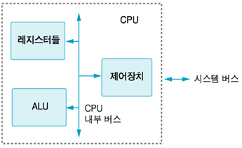

# CPU의 구조

- CPU는 여러 요소로 이루어져 있으며, 이들은 서로 협력해 명령어를 처리하고 데이터를 연산
- 주요 구성 요소: 산술 논리 장치, 제어 장치, 레지스터
- 부가적 요소: 캐시 메모리, 버스 등
- 각 요소는 독립적인 기능을 수행하지만, 서로 긴밀하게 협력해 CPU가 정상적으로 동작할 수 있도록 함

### 산술 논리 장치

- CPU의 핵심 구성 요소
- 연산을 수행하는 역할
- 명령어와 데이터를 받아 연산을 수행한 후 결과를 출력하는 구조
- **구성 요소**
    - **연산 선택기**
        - ALU에서 어떤 연산을 수행할지 결정하는 역할
        - 제어 장치에서 명령을 전달받으면 연산 선택기는 해당 명령을 해석해 올바른 연산 회로를 활성화
    - **산술 연산 회로**
        - 연산을 처리하는 전자 회로
        - 일부 고급 CPU에서는 제곱, 제곱근과 같은 복잡한 연산 수행 가능
        - 가산기, 감산기, 승산기, 제산기
    - **논리 연산 회로**
        - 논리 연산을 처리하는 역할
        - 컴퓨터가 데이터를 비교하거나 조건문을 실행할 때 중요한 역할
    - **비교 회로**
        - 두 데이터를 비교해 ‘크다’, ‘작다’, 또는 ‘같다’를 판단하는 기능 수행
        - 프로그램에서 조건문을 실행할 때 사용
    - **시프트 회로**
        - 입력된 데이터를 왼쪽 또는 오른쪽으로 이동시키는 역할
        - **왼쪽 이동**: 데이터를 2배로 곱하는 효과
        - **오른쪽 이동**: 데이터를 2로 나누는 효과
        - 데이터를 변환하거나 비트를 조작하는데 사용
        - 데이터 압축이나 암호화 같은 고급 기능에서도 활용
        - **논리적 시프트**: 빈 자리를 0으로 채움
        - **산술적 시프트**: 부호 비트를 유지하면서 이동
    - **상태 플래그**
        - 연산 결과에 대한 추가 정보를 제공하는 비트
        - ALU는 연산 결과를 처리할 때 추가 정보를 제공하기 위해 상태 플래그 생성
        - **제로 플래그**: 연산 결과가 0일 때 설정
        - **부호 플래그**: 연산 결과가 음수일 때 설정
        - **캐리 프래그**: 덧셈 연산에서 자리 올림이 발생했을 때 설정
        - **오버플로 플래그**: 부호 있는 연산에서 오버플로가 발생했을 때 설정
    - ALU 내부에 포함되지 않지만, ALU에서 연산을 수행하는 데 필요한 요소 존재
    - 이런 요소는 ALU의 연산 과정에서 데이터를 제공하거나 연산 결과를 처리하는 데 중요한 역할
        - **입력 레지스터**
            - ALU에서 연산을 수행하기 위해 메모리나 레지스터에서 가져온 데이터를 임시 저장
            - 일반적으로 A 레지스터와 B 레지스터는 2개의 입력 레지스터가 있으며, 각각 오퍼랜드 저장
        - **출력 레지스터**
            - ALU가 수행한 연산 결과를 임시로 저장
            - 연산 결과는 출력 레지스터를 거쳐 메모리 또는 CPU의 다른 구성 요소로 전달
        - **상태 레지스터**
            - 연산 결과에 대한 추가 정보 저장
            - ALU에서 명령어를 실행한 후 생성되는 상태 플래그를 저장 → **플래그 레지스터**
            - CPU가 이후 명령을 실행하는 데 중요한 역할
- **연산 수행 과정**
    - `5(0101) + 3(0011)` 연산 과정
    - **입력 수신**: 산술 연산을 수행하기 위해 메모리에서 `0101`과 `0011` 데이터를 받아 입력 레지스터에 저장
    - **연산 선택**: 연산 선택기가 제어 장치에서 전달한 제어 신호를 해석해 덧셈 연산을 수행하도록 가산기 활성화
    - **연산 수행**: 가산기에서 `0101 + 0011`을 계산해 `1000`을 생성
    - **결과 저장**: 연산 결과는 출력 레지스터에 저장하고, 필요하면 메모리로 전송
    - **상태 플러그 설정**: 결과에 따라 발생한 상태 플래그가 상태 레지스터에 기록
    
    
    

### 제어 장치

- CPU가 명령어를 해석하고 컴퓨터의 여러 구성 요소가 올바르게 작동하도록 조정하는 역할
- CPU는 프로그램을 실행하기 위해 메모리에서 명령어를 가져와 해석한 후, 필요한 연산 수행
- 이 과정에서 메모리, ALU, 입출력 장치 등과 협력해 명령을 실행할 수 있도록 지시
- **명령어 레지스터**
    - 메모리에서 가져온 명령어를 임시로 저장하는 레지스터
    - 제어장치는 명령어를 해석하고 실행하기 위해 명령어 레지스터를 가장 먼저 확인
- **명령어 해독기**
    - IR에 저장된 명령어를 해석해 어떤 작업을 수행할지 결정하는 장치
    - 명령어의 연산 코드를 해석해 산술 연산, 논리 연산, 데이터 이동 등 동작을 결정
    - 해독한 명령어 정보는 제어 신호 생성기로 전달
- **제어 신호 생성기**
    - 명령어 해독기의 결과를 바탕으로 CPU 내부 구성 요소와 메모리, 입출력 장치로 보낼 제어 신호 생성
    - 생성한 제어 신호를 확인해 CPU는 데이터를 읽고, 결과를 저장하는 등의 작업을 순차적으로 진행
- **명령어 사이클 제어기**
    - CPU가 명령어를 올바른 순서로 처리할 수 있도록 조정하는 역할
    - 명령어의 실행 단계를 순차적으로 진행하도록 제어 신호를 보내며, 각 단계가 정상적으로 완료되었는지를 한 뒤, 다음 단계로 원활히 넘어갈 수 있도록 함
- **프로그램 카운터**
    - 다음에 실행할 명령어의 메모리 주소를 저장하는 레지스터
    - CPU는 프로그램을 실행할 때 명령어를 순차적으로 처리하기 위해 프로그램 카운터가 가리키는 메모리 주소에서 다음 명령어를 가져옴 → 프로그램 카운터의 값이 자동으로 증가해 다음 명령어의 주소를 가리키도록 업데이트
    - 일반적으로 메모리에서 순차적으로 증가하는 주소를 따라가지만, 분기 또는 점프 명령이 실행되면 새로운 주소를 가리키게 됨

### 레지스터

- CPU 내부에 있는 작은 크기의 초고속 기억 장치
- 컴퓨터의 메모리 계층 구조 중 최상위에 위치하며, 모든 메모리 중 가장 빠른 속도로 데이터를 저장하고 읽기 가능
- **레지스터의 역할과 구조**
    - CPU가 작업을 처리하는 동안 명령어의 주소, 명령어 코드, 연산에 필요한 데이터, 연산 결과 등을 임시로 저장하는 데 사용
    - 일반적인 저장장치나 메모리보다 훨씬 빠른 속도로 데이터에 접근 가능
    - CPU가 실행 중인 프로그램을 빠르게 처리하는 데 필요한 데이터를 즉시 읽고 쓸 수 있도록 지원
    - CPU는 연산을 빠르게 수행하기 위해 레지스터를 사용하고, 더 큰 용량이 필요할 때는 메모리를 활용하는 방식으로 동작
    - 레지스터의 크기는 CPU 아키텍처에 따라 다름
    - 일반적으로 CPU에 따라 8비트, 16비트, 32비트, 64비트 → 한 번에 처리할 수 있는 데이터의 양
    - 데이터는 0과 1로 구성ㅇ된 비트 단위로 저장, 매우 짧은 시간동안 유지
    - 특정 기능을 수행하는 전자회로로 구성
    - CPU가 프로그램을 실행할 때 이 회로들이 협력해 데이터를 신속하게 처리할 수 있도록 함
    - **입력 회로**: 데이터를 레지스터에 저장하는 역할
    - **출력 회로**: 레지스터에 저장된 데이터를 읽어 CPU의 다른 구성 요소로 전달
    - **제어 회로**: 레지스터의 데이터 읽기/쓰기 동작을 조정
- **레지스터의 종류**
    - **일반 목적 레지스터**
        - CPU가 연산을 수행할 때 필요한 데이터를 임시로 저장하는 레지스터
        - CPU가 명령어를 실행할 때 데이터를 빠르게 저장하고 불러오기 위해 사용
        - 보통 A, B, C, D 등의 이름이 붙으며, 연산을 수행하는 동안 임시 변수처럼 활용
    - **특수 목적 레지스터**
        - CPU 제어나 시스템 운영 등 특정한 기능을 수행하는 데 사용하는 레지스터
        - **명령어 레지스터**: 현재 실행 중인 명령어 저장
        - **프로그램 카운터**: 다음에 실행할 명령어의 메모리 주소 저장
        - **누산기**: 산술 연산 및 논리 연산의 결과를 임시로 저장
        - **메모리 주소 레지스터**: 메모리에서 데이터를 읽거나 쓸 때 사용할 메모리 주소 저장
        - **메모리 데이터 레지스터**: 메모리에서 읽어온 데이터 또는 저장할 데이터를 임시 저장
        - **스택 포인터**: 스택의 최상단 위치를 가리키며, 함수 호출 및 반환 시 사용
        - **상태 레지스터(플래그 레지스터)**: ALU에서 수행한 연산 결과에 따른 상태 정보 저장

### 캐시 메모리

- CPU 내부 또는 가까운 위치에 있는 매우 빠른 속도의 기억 장치
- CPU와 메인 메모리 사이에서 중간 역할, CPU가 자주 사용하는 데이터를 임시로 저장해 처리 속도를 높이는 역할
- RAM은 CPU보다 속도가 느리기 때문에 CPU가 연산할 때마다 RAM에서 데이터를 가져오면 처리 속도 저하
- CPU는 자주 사용하는 데이터와 명령어를 캐시 메모리에 저장해 더 빠르게 접근할 수 있도록 함
- CPU가 캐시 메모리에서 데이터를 가져오면 RAM에서 직접 읽는 것보다 훨씬 빠르게 처리 가능
- RAM의 속도가 상대적으로 느리기 때문에 캐시 메모리는 CPU가 원활하게 작업 가능하도록 도움
- 캐시 메모리는 CPU가 자동으로 데이터를 저장하고 관리하므로 사용자 직접 설정 불필요
- 프로그램이 반복해서 사용하는 데이터와 명령어를 보관해 처리 시간도 단축
- 여러 계층으로 구성 → 각 계층은 속도와 용량이 다르며, CPU에 가까울수록 더 빠르지만 크기가 작음
- **L1 캐시**
    - CPU 내부에 위치
    - 가장 빠름
    - 용량이 작아 소량의 데이터만 저장 가능
- **L2 캐시**
    - L1 캐시보다 속도는 느리지만, 용량이 더 큼
    - 일부 CPU에서는 코어마다 L2 캐시가 따로 존재하기도 함
- **L3 캐시**
    - L1, L2 캐시보다 상대적으로 속도가 느리지만, CPU의 모든 코어가 공유 가능
    - 용량이 가장 크며, 외부에 위치하는 경우 다수
    - 최신 CPU에서는 L3 캐시가 코어 내부에 포함되기도 함
- L1 캐시는 빠르지만 매우 작아서 모든 데이터를 저장할 수 없음 → 여러 캐시 계층 필요
- L2, L3 캐시는 속도는 상대적으로 느리지만, 더 많은 데이터 저장 가능 → CPU 성능 최적화 도움