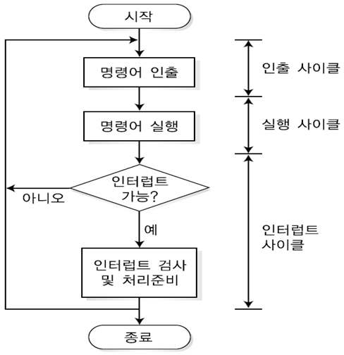

# CPU의 명령어 처리

### 클럭 속도와 명령어 처리

- CPU의 성능은 다양한 요소로 평가하지만, 클럭 속도와 명령어 처리 속도가 가장 중요한 기준
- **클럭 속도**
    - CPU가 초당 수행할 수 있는 클럭 사이클 수
    - **기가헤르츠(GHz)** 단위로 표현
    - **클럭 사이클**
        - 클럭 신호의 한 주기
        - CPU가 명령어를 처리하는 데 걸리는 최소 시간 단위
        - 클럭 속도의 역수로 계산
        - 클럭 속도가 높을수록 CPU는 더 짧은 시간에 더 많은 연산 수행 가능
- **CPU 처리 속도**
    - CPU의 실제 연산 속도는 클럭 속도로만 결정되지 않음→ CPU의 처리 속도로 측정
    - CPU가 초당 얼마나 많은 명령어를 처리할 수 있는지 측정
    
    $$
    CPU 처리 속도 = 클럭 속도 * 명령어 처리량
    $$
    
- **명령어 처리량**
    - CPU가 단위 시간 동안 처리할 수 있는 명령어의 개수
    - CPU의 아키텍처, 명령어 최적화 방식 등에 따라 달라짐
    
    $$
    명령어 처리량 = 클럭 속도 * IPC
    $$
    
- **IPC**
    - CPU가 클럭 사이틀당 처리 가능한 명령어의 개수
    - IPC가 높을수록 같은 클럭 속도에서도 더 많은 명령어를 동시에 처리 가능 → CPU 성능 향상
- 과거에는 CPU의 성능을 단순히 클럭 속도로만 평가했지만, 현대 CPU는 IPC 향상을 통해 같은 클럭 속도에서도 더 많은 명령어를 처리 가능하게 설계
- CPU 성능은 클럭 속도뿐만 아니라 IPC도 함께 고려해야 정확하게 평가 가능

### 명령어 사이클

- CPU는 프로그램을 실행하기 위해 명령어를 가져오고, 해석하고, 실행하는 과정 반복 → **명령어 사이클**
- 보통 여러 클럭 사이클에 걸쳐 수행
- CPU가 한 개의 명령어를 실행하는 데는 여러 단계가 필요

- **명령어 인출**
    - CPU가 메모리에서 다음에 수행할 명령어를 가져오는 단계
    - 1~2 클럭 사이클 소요
    
    > 프로그램 카운터(PC)가 다음에 실행할 명령어의 메모리 주소를 가리킴
    PC의 값을 메모리 주소 레지스터(MAR)에 저장
    MAR이 가리키는 메모리 주소에서 명령어를 메모리 데이터 레지스터(MDR)로 읽어옴
    MDR에 저장된 명령어를 명령어 레지스터(IR)로 전달해 저장
    PC의 값을 증가시켜 다음 명령어의 주소를 가리키도록 함
    > 
- **명령어 해석**
    - 가져온 명령어를 분석해 CPU가 수행할 작업을 결정하는 단계
    
    > 제어장치의 명령어 해독기가 IR에 저장된 명령어를 해석
    명령어의 연산코드와 오퍼랜드를 분석하고 연산에 필요한 데이터를 메모리 또는 레지스터에서 가져올 준비
    > 
- **오퍼랜드 인출**
    - 명령어가 실행되는 데 필요한 데이터를 메모리 또는 레지스터에서 가져오는 단계
    
    > 명령어 해석 단계에서 확인된 오퍼랜드를 메모리 또는 레지스터에서 읽어옴
    > 
- **명령어 실행**
    - 명령어를 실제로 실행하는 단계
    - 산술 및 논리 연산, 데이터 이동, 입출력 처리 등 다양한 작업을 수행
    - CPU의 ALU나 기타 하드웨어 사용
    
    > 제어 장치의 제어 신호 생성기가 연산 코드에 맞는 제어 신호 생성
    제어 신호가 ALU, 레지스터, 메모리 등 필요한 구성 요소로 전달되어 작업이 수행
    > 
- **결과 저장**
    - 연산 결과를 저장하고 다음 명령어 처리를 준비하는 단계
    
    > 연산 결과를 레지스터 또는 메모리에 저장
    결과에 따라 상태 레지스터의 값 변경
    필요할 경우 결과를 입출력 장치와 통신해 출력
    > 

### 명령어 처리 방식

- 컴퓨터 시스템은 CPU 아키텍처에 따라 명령어를 처리하는 방식이 다름
- **CPU 아키텍처**
    - 컴퓨터 시스템이 명령어를 처리하고 실행하는 방식을 정의하는 설계 개념
    - 명령어 집합 구조와 이를 구현하는 방식을 포함하는 일종의 설계도
    - 명령어 집합 구조를 기반으로 설계
- **명령어 집합 구조**
    - CPU와 소프트웨어 간 소통 규칙을 규정하고, 프로그램이 CPU에서 어떻게 수행될지를 정의하는 모델이자 사양
    - ISA는 CPU가 명령어를 해석하고 실행하는 방식과 관련된 모든 규칙을 정의
    - **명령어 집합**: CPU가 이해하고 실행할 수 있는 모든 명령어의 모음
    - **주소 지정 방식**: 명령어가 데이터를 참조하거나 메모리에 접근하는 방식
    - **데이터 타입**: CPU가 처리할 수 있는 데이터의 형식
    - **레지스터 구조**: CPU가 제공하는 레지스터의 개수와 종류, 크기 등을 정의
    - **명령어 형식**: 명령어가 인코딩되는 방식과 명령어의 길이를 정의
    - **메모리 모델**: CPU가 메모리에 접근하는 방식과 메모리 주소의 크기
    - **입출력 구조**: CPU가 입출력 장치와 상호작용하는 방식
- ISA는 CPU 아키텍처마다 다를 수 있으며, 동일한 ISA를 사용하더라도 마이크로아키텍처에 따라 구현 방식이 달라질 수 있음
- ISA가 다르면 명령어의 종류, 데이터 타입, 주소 지정 방식, 메모리 관리 방식 등 CPU의 전반적인 처리 규칙이 달라짐
- CPU의 설계 방식에도 영향
- **CISC**
    - 다양한 기능의 명령어를 포함한 복합 명령어 집합을 지원하는 아키텍처
    - 매우 강력하고 많은 명령어 포함
    - **복합 명령어**
        - CISC는 복잡한 작업을 적은 수의 명령어로 수행 가능하게 설계
        - 코드 크기를 줄일 수 있음
    - **가변 길이 명령어**
        - 명렁어마다 서로 다른 길이를 가지는 구조
        - 간단한 작업일 때는 짧은 명령어를, 복잡한 작업일 때는 긴 명령어 사용 가능
        - 메모리 효율을 높여 주지만, 처리 방식은 더 복잡해짐
    - CISC 방식의 대표적인 아키텍처는 인텔과 AMD CPU에서 주로 사용하는 x86
    - x86 명령어는 길이가 1바이트에서 최대 15바이트까지 다양 → 주로 윈도우 기반 PC에서 사용, 리눅스와 맥OS도 지원
    - 개인용 컴퓨터, 서버, 워크스테이션 등 다양한 분야에서 사용
- RISC
    - 단순 명령어 집합을 지원하는 아키텍처
    - **단순 명령어**
        - 명령어 수는 적지만, 각 명령어는 단일 작업을 수행하도록 설계
        - 주로 하나의 명령어가 하나의 작업 수행
    - **고정 길이 명령어**
        - RISC는 주로 고정 길이 명령어 사용
        - 모든 명령어가 동일한 크기로 구성된 구조를 의미
        - 모든 명령어가 16비트, 32비트 또는 64비트 길이를 가짐
        - 명령어 처리가 빠르고 효율적이지만, 상대적으로 메모리 사용 효율은 떨어질 수 있음
    - 대표적인 RISC 방식의 아키텍처는 모바일 기기와 임베디드 시스템에서 널리 사용하는 ARM
    - ARM CPU는 32비트와 64비트 2가지 → 리눅스, 맥OS, 안드로이드, iOS
- **CISC와 RISC 방식 비교**
    - **CISC 방식**
        - 다양한 명령어를 지원해 적은 수의 간단한 명령어로 프로그램을 구송하고 실행 가능
        - 소프트웨어에 부담이 적고 생산성이 높음
        - 컴파일 과정이 쉽고 호환성이 좋음
        - 명령어가 많아서 설계가 어렵고 속도가 느림
    - **RISC 방식**
        - 명령어 길이가 같아서 같은 시간에 수행되고 파이프라이닝 처리가 쉬움
        - 처리속도가 빠르고 하드웨어 구조가 간단하며 전력 소모가 적음
        - 명령어 수가 적어서 소프트웨서의 부담이 커지고 호환성이 낮음
    
    | **구분** | **CISC** | **RISC** |
    | --- | --- | --- |
    | 명령어 구조 | 복합 명령어: 단일 명령어로 복잡한 작업 수행 | 단순 명령어: 단일 명령어가 하나의 작업 수행 |
    | 명령어 길이 | 가변 길이: 명령어에 따라 길이가 다름 | 고정 길이: 모든 명령어가 동일한 길이 |
    | 처리 속도 | 명령어 해석과 실행이 복잡해 속도가 상대적으로 느림 | 단순 명령어와 파이프닝 처리가 가능해 속도가 빠름 |
    | 하드웨어 설계 | 복잡한 구조: 복합 명령어 실행을 위해 복잡한 제어 로직과 하드웨어 사용 | 간단한 구조: 단순 명령어 실행을 위한 하드웨어 구현이 단순 |
    | 명령어 사이클 | 복합 명령어는 여러 사이클이 필요할 수 있음 | 대부분의 명령어가 한 사이클 내에서 처리됨 |
    | 적용 분야 | 고성능 PC, 서버 등 복잡한 작업이 요구되는 환경 | 모바일, 임베디드 시스템, IoT 등 저전력 고효율 환경 |
- **CISC와 RISC의 명령어 사이클 비교**
    - 어셈블리어 코드(`MULT 5:7, 4:3`)로 비교
    - **CISC 방식**
        - `MULT 5:7, 4:3` : 두 비트의 값을 곱하고 결과를 저장하는 작업을 한 번에 수행하는 복합 명령어
        - 메모리에서 데이터를 불러와 곱셈 연산후 결과를 저장하는 작업을 한 번에 수행
        - 작업이 하나의 명령어로 압축되어 적은 클럭 사이클을 소요
    - **RISC 방식**
        - 복합 명령어는 단순 명령어 조합으로 나누어 표현 가능
        - 복합 명령어 `MULT` 는 단순 명령어 `LOAD`, `PROD`, `STORE`로 분리해 처리
        - 각 명령어는 개별적으로 실행, 각 작업에 추가적인 클럭 사이클 소요
    - 복합 명령어는 적은 수의 명령어로 복잡한 작업을 수행 → 적은 클럭 사이클로 실행 가능
    - 복잡한 작업을 수행할 때 CISC 아키텍처가 RISC 아키텍처보다 효율적인 이유
    - RISC는 각 명령어를 독립적으로 실행하지만, 파이프라이닝을 사용해 빠르게 실행가능
    - 작업의 성격과 CPU 아키텍처에 따라 CISC와 RISC 방식의 효율성은 다름

### 인터럽트

- 컴퓨터 시스템에서 CPU는 하드웨어 장치의 중요한 이벤트나 프로그램의 요청에 즉시 반응해야 함
- 반응이 없다면 시스템은 사용자 입력을 무시하거나 중요한 작업을 놓칠 수 있음
- CPU는 현재 수행 중인 작업을 잠시 멈추고 중요한 이벤트를 먼저 처리하는 메커니즘
- CPU가 특정 이벤트를 처리할 수 있도록 작업 흐름을 조정하는 역할
- 인터럽트가 발생하면 CPU는 현재 실행 중인 명령어를 잠시 멈추고 인터럽트를 처리한 후 다시 원래 작업을 재개
- **인터럽트 종류**
    - **소프트웨어 인터럽트**
        - 소프트웨어 또는 CPU 내부에서 발생하는 인터럽트
        - 운영체제의 기능 호출이나 에러를 처리하는 데 사용
        - 파일 열기, 네트워크 전송 요청 등 운영체제의 서비스를 프로그램이 요청하면 인터럽트를 발생시켜 시스템 호출을 처리
        - 잘못된 명령어를 실행하면 CPU가 오류를 감지하고 인터럽트 발생
    - **하드웨어 인터럽트**
        - 키보드, 마우스, 네트워크 등 외부 하드웨어 장치에서 발생하는 신호에 의해 CPU가 즉시 반응해야 할 때 발생
        - CPU가 실행 중인 명령어와 무관하게 발생하는 비동기적 이벤트
        - CPU는 하드웨어 인터럽트를 통해 외부 장치와 효율적으로 상호작용 가능
- **인터럽트 처리 과정**
    - 인터럽트가 발생하면 CPU는 현재 작업을 일시 중단하고 인터럽트를 처리한 후 다시 원래 작업 재개
    
    
    
    - **인터럽트 발생**: 하드웨어 또는 소프트웨어가 CPU에 인터럽트 요청
    - **인터럽트 요청 확인**: CPU는 인터럽트 플래그를 주기적으로 확인. 요청이 활성화되면 현재 실행중인 명령어를 완료한 후 인터럽트 처리 시작
    - **컨텍스트 저장**: CPU는 컨텍스트 저장. 저장한 정보는 인터럽트 처리가 끝난 후 원래 작업을 다시 실행하는 데 필요
    - **인터럽트 우선순위 확인**: 여러 인터럽트가 동시에 발생할 수 있으므로 CPU는 우선 순위를 확인. 긴급 시스템 오류와 같은 중요한 인터럽트를 우선 처리, 덜 중요한 인터럽트는 대기
    - **인터럽트 서비스 루틴 실행**: CPU는 인터럽트 벡터 테이블을 참조해 적절한 인터럽트 서비스 루틴을 실행. **인터럽트 서비스 루틴**은 인터럽트가 발생했을 때 실행되는 특수한 프로그램 코드
    - **인터럽트 처리 완료**: ISR 실행이 끝나면 CPU는 인터럽트 플래그를 초기화해 새로운 인터럽트를 받을 준비
    - **컨텍스트 복원 및 작업 재개**: CPU는 인터럽트 발생 전에 저장했던 컨텍스트를 복원. 원래 실행 중이던 프로그램으로 돌아가 작업을 계속 수행