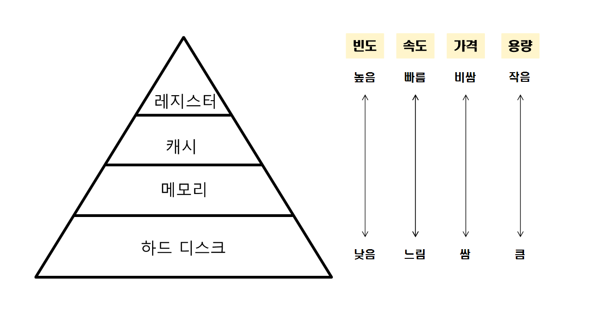

# 메모리 개요

- **메모리**
    - 컴퓨터가 데이터를 저장하고 관리하는 모든 장치
    - 메모리와 주 기억 장치를 같은 의미로 사용하기도 하지만, 주 기억 장치뿐만 아니라 보조 기억 장치도 포함하는 더 넓은 개념

### 메모리의 역할과 특징

- **CPU와 프로그램 실행 지원**
    - 메모리는 CPU가 처리할 데이터를 빠르게 제공해 시스템 성능 최적화
    - 운영체제와 프로그램은 메모리에 로드되어 실행
    - CPU는 메모리에 저장된 데이터를 신속하게 읽고 쓰면서 프로그램 실행
- **중간 저장소 역할**
    - 메모리는 CPU가 연산하는 동안 발생하는 중간 데이터 저장
    - 복잡한 계산 과정에서 연산 결과를 임시 저장해 연산 최적화 가능
- **멀티태스킹 지원**
    - 여러 프로그램이 동시에 실행될 수 있도록 독립적인 메모리 공간 할당
    - 운영체제는 각 프로그램이 서로 간섭하지 않도록 메모리를 효율적으로 관리
- **속도와 휘발성**
    - 메모리는 CPU와 직접 연결되어 매우 빠른 데이터 접근 속도를 가짐
    - 하지만 대부분의 메모리는 휘발성이므로 전원이 꺼지면 데이터가 사라짐
    - 영구적인 저장을 위해 SSD나 HDD 같은 보조 기억 장치 필요

### 메모리의 계층 구조

- 메모리는 컴퓨터의 성능과 효율성을 극대화하기 위해 계층 구조를 이루도록 설계
- 데이터 접근 속도와 저장 비용 사이의 균형을 맞추기 위해 여러 유형의 메모리를 계층적으로 배열

- **레지스터**
    - CPU 내부에 위치한 초고속 메모리
    - 용량은 매우 작지만 접근 속도가 가장 빠름
    - CPU가 직접 연산에 사용하는 데이터와 명령어를 저장하는데 사용
- **캐시 메모리**
    - CPU와 주 기억 장치 사이에 위치
    - 레지스터 다음으로 속도가 빠름
    - CPU가 자주 사용하는 데이터와 명령어를 임시로 저장해 접근 시간을 줄이고 성능을 향상시키는 역할
- **주 기억 장치**
    - 캐시보다 느리지만 용량이 크고 비용이 상대적으로 저렴해 시스템의 주요 작업 공간으로 사용
    - 실행 중인 프로그램과 데이터를 저장하는데 사용
- **보조 기억 장치**
    - 주 기억 장치보다는 접근 속도가 느리지만 용량이 커서 대용량 데이터를 저장
    - 데이터를 영구적으로 저장하는 데 사용
- CPU는 필요한 데이터와 명령어를 가장 빠른 계층에서 먼저 찾으려 시도하고, 없을 경우 다음 계층의 메모리에서 탐색
    - **빠른 계층**: CPU가 즉시 데이터에 접근해 처리 속도를 높임
    - **느린 계층**: 더 많은 데이터를 저장하고 필요한 데이터를 상위 계층으로 전달

### 메모리의 구성 요소

- **메모리 셀**
    - 메모리에서 데이러를 저장하는 기본 단위
    - 각 메모리 셀은 1비트의 데이터 저장 가능
    - 0 또는 1 중 하나의 상태
    - 일반적으로 트랜지스터와 커패시터로 구성
    - 트랜지스터: 전류의 흐름을 제어하는 스위치
    - 커패시터: 전하를 저장해 데이터를 유지
    - DRAM: 하나의 트랜지스터와 하나의 커패시터로 구성된 메모리 셀 사용
    - SRAM: 여러 개의 트랜지스터를 조합해 플립플롭 형성
    - **트랜지스터**
        - 메모리 셀의 기본 구성 요소
        - 전류의 흐름을 제어해 메모리 셀의 상태를 0 또는 1로 설정
        - 메모리 셀에서 데이터를 읽거나 쓸 때 특정한 전압으로 셀의 상태를 변경하거나 읽어옴
        - 쓰기 동작에서는 전류를 흐르게 해 셀의 상태를 변경하고, 읽기 동작에서는 셀의 상태를 감지해 출력
        - 전류의 흐름을 차단할 수 있는 기능도 있어서 메모리 셀의 상태를 유지
    - **커패시터**
        - 전하를 저장하는 소자
        - 데티러 비트를 저장하는 데 사용
        - 전하의 유무에 따라 0 또는 1의 값
        - DRAM에서는 커패시터의 전하가 시간이 지남에 따라 방전되기 때문에 주기적으로 리프레시
    - **플립플롭**
        - SRAM 메모리 셀에서 데이터 비트를 저장하는 데 사용
        - 전원이 공급되는 한 데이터를 안정적인 상태로 유지
- **주소 디코더**
    - 메모리 셀에 접근하는 데 필요한 주소를 해석하는 회로
    - CPU가 특정 메모리에 접근하면 주소 디코드는 주어진 주소에 해당하는 메모리 셀을 활성화해 데이터를 읽거나 쓸 수 있게 함
    - 메모리는 바둑판처럼 배열된 행과 열의 구조
    - 메모리에 접근하려면 특정 행과 열의 주소를 지정 → 행 주소 스트로브와 열주소 스트로브 사용
    - **행 주소 스트로브**
        - 메모리의 특정 행을 선택하는 신호
        - 메모리 셀의 행을 활성화해 해당 행에 있는 데이터에 접근 가능
        - RAS가 활성화되면 지정된 행의 모든 셀을 읽거나 쓸 수 있는 상태
    - **열 주소 스트로브**
        - 선택된 행 내에서 특정 열을 선택하는 신호
        - CAS가 활성화되면 지정된 열의 데이터에 접근해 읽고 쓰기 가능
    - 메모리를 행과 열로 구분해 특정 위치에 접근하는 방식은 메모리 접근의 정확성과 효율성을 극대화
    - 메모리는 많은 양의 데이터를 효율적으로 관리, 데이터에 빠르게 접근 가능
    - DRAM에서는 리프레시 주기와 RAS가 활성화된 후 CAS가 활성화되기까지 필요한 시간이 메모리의 성능에 큰 영향
- **데이터 버스**
    - CPU의 메모리 간에 데이터를 전송하는 통로
    - 메모리에서 데이터를 읽고 쓸 때 데이터 버스를 통해 데이터를 전달
    - 양방향으로 데이터를 주고받기 가능
    - 여러 선으로 구성
    - 각 선은 데이터를 비트 단위로 전송
    - 데이터 버스의 폭은 한 번에 전송할 수 있는 데이터으 양 결정
    - 폭이 넓을수록 데이터 전송 속도가 빠름
- **제어 회로**
    - 메모리의 작동을 관리하고 조정하는 역할
    - 메모리 읽기 및 쓰기 작업을 제어, 주소 디코더와 데이터 버스의 동작 조정
    - 메모리 셀에서  읽기와 쓰기는 제어 회로가 보내는 제어 신호에 따라 결정
    - 데이터 읽을 때: 메모리 셀의 현재 상태를 감지해 저장된 값 판별
    - 데이터 쓸 때: 모메리 셀에 전하를 저장하거나 방출해 셀을 0 또는 1로 설정
    - 제어 회로의 제어 단자, 선택 단자, 입력 단자는 각각의 기능 수행
    
    
    
    - **제어 단자**
        - 메모리 셀이 읽기 작업을 수행할지, 쓰기 작업을 수행할지 지정하는 역할
        - 읽기 또는 쓰기 신호를 전송해 메모리 셀의 동작 결정
    - **선택 단자**
        - 읽기 또는 쓰기 작업을 실행할 메모리 셀을 선택하는 역할
        - 메모리 컨트롤러가 CPU에서  받은 메모리 주소를 바탕으로 선택 단자 활성화
        - 메모리 컨트롤러의 신호에 따라 읽기 또는 쓰기 작업을 수행할 특정 셀을 지정
        - 이후 CPU나 I/O 장치는 해당 셀에 접근 가능
    - **감지 단자**
        - 메모리 셀에서 데이터를 읽어올 때 사용
        - 메모리 셀의 현재 상태를 판별하고 그 상태를 이진수로 변환
    - **입력 단자**
        - 데이터를 입력 받아 메모리 셀에 저장하는 역할
        - 제어 단자의 지시에 따라 입력 단자에 전달된 데이터가 메모리 셀에 기록
- **감지 증폭기**
    - 메모리 셀의 데이터를 읽을 때 신호를 증폭하는 역할
    - 메모리 셀의 감지 단자에서 발생하는 미세한 전압 변화를 감지하고 이를 증촉해 더 강한 신호로 변환
- **클럭 회로**
    - 메모리의 모든 동작을 동기화하는 역할
    - 주기적으로 클럭 신호를 발생해 메모리에서의 읽기, 쓰기, 리프레시와 같은 작업의 타이밍 제어
    - 메모리 컨트롤러는 클럭 신호를 기반으로 언제 데이터를 읽거나 쓸지를 결정
    - 메모리의 상태는 클럭 신호에 따라 변함

### 메모리 접근

- 컴퓨터가 데이터를 읽거나 쓰는 과정
- **명령 전송**
    - CPU는 메모리 컨트롤러에 데이터 요청
    - 해당 요청은 어떤 주소에 접근할지, 데이터를 읽을지 또는 쓸지에 대한 정보 포함
- **주소 지정**
    - 메모리 컨트롤러가 요청되 ㄴ데이터의 주소를 기반으로 특정 메모리 셀을 선택
    - RAS가 특정 행 선택 CAS가 열을 선택 → 정확한 메모리 셀 지정
- **데이터 전송**
    - 선택된 메모리 셀에서 데이터를 읽거나 씀
    - 읽기 작업: 메모리에서 데이터를 가져와 CPU로 전송
    - 쓰기 작업: CPU에서 데이터를 받아 메모리에 저장
- **접근 시간**: 메모리 접근 과정에 걸리는 시간
- CPU가 데이터를 요청한 후 실제로 데이터를 읽을 때까지 걸리는 시간
- 메모리 유형에 따라 접근 시간이 다름
- SRAM은 매우 빠르지만 비싸고 용량이 적어 주로 캐시 메모리로 사용
- DRAM은 상대적으로 느리지만 저렵하고 대용량 저장이 가능해서 주 기억 장치로 사용
- **사이클 시간**
    - 메모리가 데이터를 읽거나 쓴 후 다음 작업을 수행할 수 있을 때까지 걸리는 시간
    - 접근 시간과 리프레시 시간을 합쳐 결정
    - 짧을수록 더 빠른 데이터 처리가 가능해 시스템 반응 속도 향상