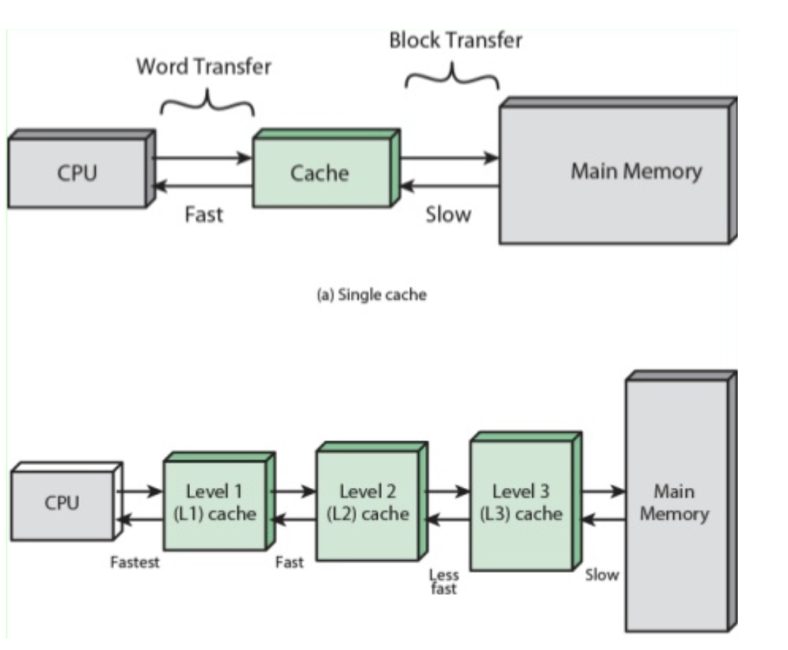

# 캐시 메모리

- CPU와 RAM 사이에서 데이터 접근 속도를 향상시키는 역할
- CPU의 처리 속도는 매우 빠르지만 RAM의 속도는 상대적으로 느리기 때문에 캐시가 이를 보완해 시스템 성능 최적화

### 캐시의 구조

- 자주 사용하는 데이터와 명령어를 임시 저장해 CPU가 더 빠르게 접근할 수 있도록 설계된 고속 메모리
- CPU와 RAM간 속도 차이를 극복하기 위해 사용
- CPU 내부에 존재하거나 외부에 별도로 존재
- 계층적 구조를 가지며, 속도와 용량에 따라 L1, L2, L3로 구분
- **L1 캐시**
    - CPU 내부에 존재
    - 용량이 작지만 속도가 매우 빠름
    - CPU가 가장 먼저 데이터를 찾는 공간
    - 명령어 캐시와 데이터 캐시로 나뉨
    - 각각 명령어와 데이터를 독립적으로 저장하고 처리
- **L2 캐시**
    - CPU 내부 또는 외부에 위치
    - L1 캐시보다 용량은 크지만 속도는 상대적으로 느림
    - L1 캐시에 없는 데이터 저장
- **L3 캐시**
    - 여러 CPU 코어가 공유하는 캐시
    - CPU 외부에 위치
    - CPU 코어 간에 데이터를 원활하게 공유하도록 설계
    - L2 캐시보다 용량이 더 크지만 상대적으로 데이터 접근 속도가 느림
    - L1과 L2 캐시에서 처리하지 못한 데이터 처리

- 캐시는 CPU가 필요한 데이터를 미리 가져와 저장하는 방식으로 데이터 접근 속도를 높임
- 제조 비용이 높아 RAM보다 용량이 작음

### 캐시의 작동 방식

- CPU에서 필요한 데이터가 캐시 네에 존재하는지 여부는 캐시의 성능을 결정짓는 중요한 요소
- **캐시 히트**
    - CPU가 찾고 있는 데이터가 캐시 안에 있을 때
    - 데이터에 바로 접근 가능
- **캐시 미스**
    - 필요한 데이터가 캐시에 없어 다른 메모리 영역에서 찾아야 하는 경우
    - CPU는 다른 계층의 캐시나 RAM으로부터 데이터를 가져와야 하므로 성능 저하 발생
- **작동 과정**
    1. CPU가 특정 데이터 요청
    2. 캐시 메모리를 관리하고 제어하는 캐시 컨트롤러가 캐시에 해당 데이터 있는지 확인
    3. 데이터가 캐시에 있으면 캐시 히트가 되어 CPU에 데이터 즉시 제공
    4. 데이터가 캐시에 없으면 캐시 미스 발생
    캐시 컨트롤러는 다른 계층 캐시 또는 RAM에서 데이터 가져옴
    5. 캐시 컨트롤러는 가져온 데이터를 CPU에 제공한 후 캐시 미스가 발생한 캐시에 저장
- **히트율**
    - 요청한 데이터가 캐시에 있으면 히트율이 올라감
    - 전체 데이터 요청 중 캐시에서 데이터를 성공적으로 찾은 비율
    
    $$
    히트율 = (캐시 히트 횟수 / 전체 데이터 요청 횟수) * 100
    $$
    
    - 히트율이 높을수록 CPU가 더 적은 시간에 데이터 찾기 가능
    - 히트율이 낮으면 캐시 미스가 증가해 시스템 성능 저하
- 캐시 크기가 클수록 더 많은 데이터를 저장 가능 → 히트율 높아짐
- 캐시가 너무 크면 속도 느려짐

### 캐시의 데이터 전송 단위

- CPU가 캐시에 데이터를 요청할 때 보통 워드 단위로 이루어짐
- **워드**
    - CPU에서 한 번에 처리할 수 있는 데이터의 크기
    - 워드 크기는 CPU 아키 텍처에 따라 달라짐
    - 워드 크기는 CPU가 처리할 데이터의 기본 단위 결정
    - 위드 크기가 클수록 많은 데이터 처리 가능 → 시스템 전반적인 처리 능력 향상
    - CPU에서 캐시에 데이터를 저장하거나 전달할 때도 워드 단위를 기본으로 사용
- **블록**
    - 캐시와 RAM 간 데이터 전송 단위
    - 한 블록은 여러 워드로 구성, 블록 크기는 CPU 아키텍처에 따라 다름
    - 블록 크기는 캐시가 RAM에서 데이터를 가져올 때 얼마나 많은 양의 데이터를 한 번에 가져오는지 결정
    - 블록 크기가 크면 한 번에 많은 데이터를 가져올 수 있어 히트율을 높이고 캐시 미스를 줄일 수 있음
    - 전송 시간이 길어지고 제한된 공간에 불필요하게 많은 데이터가 저장되어 공간 낭비 발생 가능
    - 블록 크기가 작으면 전송 시간이 짧아지지만 히트율이 떨어져 캐시 미스가 자주 발생하고 메모리 접근 횟수가 늘어나 성능 저하
- 캐시의 성능은 CPU가 요구하는 데이터 워드의 크기와 RAM으로부터 가져온 데이터 블록의 크기에 영향
- 워드 크기와 블록 크기가 적절하게 설정되면 CPU가 필요한 데이터를 캐시에서 더 효율적으로 찾기 가능

### 캐시의 성능 관리

- 지역성을 활용한 계층적 설계, 교체 정책, 주소 매핑 등 다양한 방법을 통해 캐시의 효율성과 성능 높이기 가능
- **지역성**
    - 캐시의 성능은 CPU가 작업하는 동안 캐시에서 데이터를 얼마나 효율적으로 가져오는지에 따라 달라짐 → 지역성에 큰 영향을 받음
    - CPU가 메모리의 특정 부분을 집중적으로 사용하는 경향성
    - **공간 지역성:** 특정 데이터에 접근하면 그와 인접한 데이터도 접근할 가능성 높음
    - **시간 지역성**: 한 번 사용한 데이터는 짧은 시간 안에 다시 사용할 가능성 높음
    - 캐시를 설계할 때 지역성을 활용하면 데이터를 효율적으로 저장하고 성능을 크게 향상시키기 가능
    - **캐시 계층 설계**
        - 캐시를 L1, L2, L3로 계층화해 속도와 용량 간 균형을 맞춤
        - 가장 자주 사용하는 데이터: L1 캐시
        - 덜 사용하는 데이터: L2, L3 캐시
    - **블록 단위 데이터 저장**
        - RAM에서 데이터를 블록 단위로 캐시에 가져옴
        - 공간 지역성을 활용해 근접 데이터를 함께 저장하면 이후 요청에서 히트율 높아짐
- **교체 정책**
    - 캐시는 크기가 제한적이므로 캐시가 가득 찼을 때 새로운 데이터를 저장하려면 기존 데이터를 삭제해야 함 → **캐시 교체 정책**
    - **LRU**
        - 가장 오랫동안 사용하지 않은 데이터 삭제
        - 최근에 사용한 데이터는 앞으로도 사용할 가능성이 높다는 시간 지역성 기반
        - 대부분의 프로그램에서 효율적으로 동작
        - 최근 사용 순서를 추적해야해서 구현 복잡
    - **FIFO**
        - 캐시에 가장 먼저 들어온 데이터 삭제
        - 구현 간단, 낮은 비용
        - 데이터 순서 추적에 효율적
        - 오래된 데이터를 여전히 자주 사용하는 경우 비효율적, 시간 지역성 반영 불가
    - **LFU**
        - 가장 적게 사용한 데이터 삭제
        - 각 데이터의 접근 빈도를 추적해 교체 대상 선정
        - 자주 사용하지 않는 데이터 제거 가능
        - 최근 데이터를 낮은 빈도로 사용한 경우 삭제
    - **ARC**
        - LRU와 LFU를 결합한 정책
        - 자주 사용하는 데이터와 최근에 사용한 데이터를 동적으로 관리
        - 다양한 데이터 접근 패턴에 적용 가능
        - 캐시 히트율 높음
    - **Random**
        - 캐시에서 무작위로 데이터 삭제
        - 데이터 접근 패턴을 고려하지 않아서 구현이 매우 간단하고 비용이 낮지만, 데이터 사용 패턴에 최적화 되지 않아 효율성이 낮음
    - 각 정책은 특정 데이터 접근 패턴에서 효율적으로 작동
    - 필요에 따라 정책을 결합하거나 개선된 알고리즘 사용
- **쓰기 정책**
    - CPU에서 데이터를 캐시에 저장할 때 이를 RAM과 동기화하는 방법
    - 읽기보다 복잡하고 느릴 수 있으므로 적절한 쓰기 정책을 사용하면 캐시 성능을 크게 향상
    - **Write-Back**
        - 쓰기 요청이 발생할 때 데이터를 캐시에만 저장
        - RAM에는 나중에 저장
        - 데이터가 캐시에서 제거되거나 교체될 때 메모리에 저장하므로 쓰기 작업이 빠르고, 메모리 대역폭 사용량이 감소
        - 여러 번 업데이트한 데이터를 한번에 RAM에 저장해서 효율적
        - 시스템 충돌이 발생하면 캐시에 있는 데이터가 손실될 가능성, RAM과 캐시 간 데이터가 일치하지 않아 동기화 문제 발생
            
            
            
    - **Write-Through**
        - 데이터를 캐시와 RAM에 동시에 저장하는 방식
        - 캐시와 RAM이 항상 동기화 상태를 유지해서 데이터 일관성이 보장되고 시스템 충돌 시 데이터 손실이 적음
        - RAM에도 항상 데이터를 저장하므로 쓰기 속도가 느리고 메모리 대역폭 사용량이 증가
            
            
            
    - **Write-Around**
        - 데이터를 RAM에만 저장하는 방식
        - 캐시에 쓰기 작업을 건너뛰므로 캐시 오염 방지
        - 자주 사용하지 않는 데이터를 캐시에 저장하지 않으므로 캐시의 공간 효율성이 증가
        - 데이터를 읽으려면 RAM에서 다시 가져와야 하므로 읽기 성능 저하 가능

- **캐시 주소 매핑**
    - 캐시는 RAM보다 상대적으로 작기 때문에 RAM과 1대1로 완벽하게 매핑 불가능
    - 어떤 데이터를 캐시에 저장할지 결정하는 매핑 방식 필요
    - **직접 매핑**
        - RAM을 일정 크기 블록으로 나누고, 이를 캐시의 특정 위치에 할당하는 방식
        - 각 블록은 고유한 식별자인 태그로 식별
        - 간단한 구현, 직관적
        - 여러 블록이 같은 캐시 위치를 공유하는 충돌 문제 발생 가능성
    - **완전 연관** **매핑**
        - RAM의 블록이 캐시 어디든 저장될 수 있는 방식
        - RAM 블록이 캐시에 저장될 때 해당 블록의 태그도 함께 저장
        - CPU가 특정 블록을 요청하면 캐시 내 모든 태그와 요청된 태그를 비교해 데이터를 찾음
        - 블록이 캐시 어디에나 저장될 수 있어서 충돌문제가 발생하지 않으며 히트율이 높음
        - 구현이 복잡하고 캐시 전체를 검색해야 해서 검색 시간이 길어질 수 있음
    - **집합 연관 매핑**
        - 직접 매핑과 완전 연관 매핑을 절충한 방식
        - 캐시를 여러 집합으로 나누고 각 집합에서 완전 연관 매핑 사용
        - 데이터는 특정 집합에만 저장, 집합 내에서는 자유롭게 사용 가능
        - 직접 매핑보다 충돌 문제가 줄어들고 히트율도 높지만 여전히 충돌 가능성이 있고 직접 매핑보다 구현 복잡
        
        