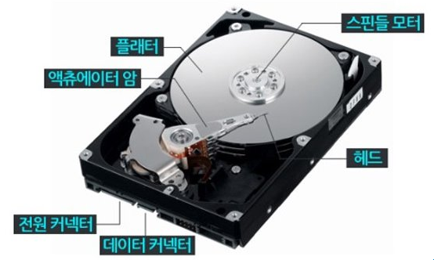

# HDD와 SSD

### HDD

- 자기 디스크에 데이터를 저장하고 기계식 헤드로 디스크를 읽고 쓰는 장치
- 같은 용량의 SSD보다 속도는 느리지만 가격이 저렴해 대용량 데이터를 저장하는 데 적합
- **구성요소**
    - **플래터**: 데이터를 저장하는 원형의 자기 디스크 →**스핀들**을 중심축으로 고속 회전
    - **회전 속도**: 디스크의 성능을 구성하는 중요 요소
    - 플래터가 여러 개 쌓여 있는 구조
    - 양면에 각각 데이터 저장 가능
    - 각 플래터 표면에는 **읽기/쓰기 헤드** 하나씩 존재
    - 헤드는 플래터와 접촉하지 않고, 플래터 표면 위를 미세하게 떠있는 상태로 이동
    - 데이터를 자기적 신호로 저장하면 헤드가 이름 감지해 데이터를 읽고 씀
    - 헤드는 액추에이터 암에 연결
    - **액추에이터 암**: 엑추에이터라는 구동 장치에 달린 긴팔 모양의 구조물, 헤드를 이동시키는 역할
    → 액추에이터 암은 피벗을 축으로 움직임
    → 정확한 데이터 위치에 헤드 도달
    
    
    
- **저장 구조**
    - **트랙**
        - 데이터를 저장하는 경로
        - 플래터에 동심원 형태로 배열
        - 각 플래터는 여러 트랙으로 구성
        - 플래터 중심에서 바깥쪽으로 갈수록 트랙 번호 증가
    - **섹터**
        - 트랙을 더 작게 나눈 것
        - 데이터를 저장하는 최소 단위
        - 보통 한 섹터는 `512바이트~4KB`까지 데이터 저장
    - **실린더**
        - 여러 플래터에서 동일한 트랙 번호를 수직으로 정렬한 데이터 단위
        - 여러 플래터에서 데이터를 동시에 접근하거나 읽을 때 사용
    - **클러스터**
        - 파일 시스템에서 데이터를 저장하는 기본 단위
        - 여러 섹터로 구성
        - 하나의 클러스터는 1개 이상의 섹터로 구성
        - `1KB`, `2KB`, `4KB`, `8KB`
        
        
        
    - **저장 방식**
        1. 사용자가 파일을 저장하면 논리적 주소 할당
        2. 운영체제는 논리적 주소를 물리적 주소로 변환
        물리적 주소는 트랙, 섹터로 구성
        3. 액추에이터 암이 읽기/쓰기 헤드를 해당 트랙 위로 이동시킴
        이 과정에서 발생하는 시간 → **탐색 시간**
        4. 스핀들이 플래터를 회전시켜 해당 섹터가 헤드 아래로 오도록 함
        이 과정에서 발생하는 시간 → **회전 지연 시간**
        5. 헤드가 저장할 데이터를 디지털 신호로 변환
        데이터 읽기: 헤드는 플래터 표면의 자기적 상태를 감지해 데이터를 읽고 디지털 신호로 변환
        데이터 쓰기: 헤드는 플래터 표면에 자기적 신호를 생성해 데이터를 쓰고 기존 데이터는 새로운 데이터로 덮어 씀
        6. 작업이 끝나면 운영체제는 데이터가 성공적으로 저장되었음을 확인하고 사용자에게 알림
- **성능을 결정하는 주요 요소**
    - **탐색 시간**
        - 읽기/쓰기 헤드가 원하는 트랙으로 이동하는 데 걸리는 시간
        - HDD의 성능에 가장 큰 영향을 미치는 요소 중 하나, 탐색 시간이 짧을수록 성능 향상
        - 일반 HDD의 탐색 시간은 보통 `5~15ms` 이며, 고성능 HDD는 더 짧을 수 있음
        - 단편화된 파일은 탐색 시간을 증가시켜 성능 저하 유발
    - **회전 지연 시간**
        - 플래터가 회전해 원하는 섹터가 헤드 아래 도달할 때까지 걸리는 시간
        - 회전 지연 시간은 플래터의 회전 속도에 따라 결정
        
        $$
        평균 회전 지연 시간 = (60초 / RPM) / 2
        $$
        
    - **데이터 전송 속도**
        - HDD/SSD가 데이터를 읽거나 쓰는 속도
        - 인터페이스와 캐시의 성능에 의해 영향을 받음
        - 일반 HDD의 전송 속도는 `100~200MB/s` 수준
        - SSD는 `수천 MB/s`에 이름
    - **디스크 단편화**
        - 파일이 여러 트랙과 섹터에 분산되어 저장된 상태
        - 탐색 시간과 회전 지연 시간을 늘려 성능 저하 초래
        - **디스크 조각 모음**으로 단편화를 줄이면 성능 회복 가능
            - HDD 성능 최적화
                - RPM이 높은 HDD 사용 → 회전 속도가 빠를수록 데이터 접근 속도 향상
                - 디스크 조각 모음을 수행 → 단편화된 파일을 저장하면 탐색 시간 감소
                - 버퍼가 큰 HDD 선택 → 버퍼가 클수록 데이터 처리 속도 향상

### SSD

- 솔리드 스테이트 드라이브
- 플래시 메모리를 사용해 데이터를 저장하는 고속 저장하는 장치
- 기계적 부품이 없어 내구성이 뛰어나고 작동 중 소음 없음
- 데이터를 읽고 쓰는 속도도 HDD보다 5~10배 빠름
- 발열과 전력 소비가 HDD보다 적고 충격과 진동에 강함
- 크기도 작고 가벼워 모바일 기기와 노트북에 적합
- HDD보다 비쌈
- **SSD의 구성 요소**
    - 기계식 부품 없음
    - 비휘발성 메모리인 NAND 플래시 메모리 사용해 데이터 저장
    - 데이터 읽기, 쓰기, 삭제 작업 모두 NAND 플래시 메모리에서 이루어짐
    - **SSD 컨트롤러**
        - 데이터 관리
        - 데이터의 읽기, 쓰기, 삭제 작업 관리 성능과 효율성 최적화, NAND 플래시 메모리와의 인터페이스를 관리해 데이터 전송 수행
    - **인터페이스**
        - 데이터 전송을 담당하는 연결 장치
        - 주로 SATA와 NVMe를 사용
        - SATA SSD는 일반적으로 최대 `600MB/s`의 전송 속도를 지원
        - NVMe SSD는 SATA SSD보다 훨씬 빠르며, 최대 `7000MB/s`의 전송 속도를 지원
        - SATA는 일반적인 데이터 저장 및 백업에 적합
        - NVMe는 데이터 전송 속도가 중요한 고성능 작업에 적합
    - **DRAM 캐시**
        - 데이터 전송 속도를 높이기 위해 임시 저장소로 사용
        - DRAM 캐시에 저장한 후, NAND 플래시 메모리에 저장
        - 외부 장치와 SSD 간 처리 속도 차이를 줄여 SSD의 성능을 크게 향상
        - 모든 SSD가 DRAM 캐시를 사용하지는 않음
        - DRAM이 없는 SSD도 존재 → 저렴한 가격, 성능이 떨어짐

- **SSD의 저장 구조**
    - 셀 → 페이지 → 블록 → 플레인 단위로 저장
    - **셀**
        - 데이터를 저장하는 최소 단위
        - 전자 저장, 전자의 유무로 디지털 신호 표현
        - 전자가 있으면 0, 없으면 1
        - NAND 플래시 메모리 → 셀에 저장할 수 있는 비트 수에 따라 나뉨
        - SSD의 속도와 내구성은 NAND 플래시의 종류에 따라 달라짐
        
        
        
        - **SLC**
            - 셀당 1비트 데이터 저장
            - 속도가 빠르고 내구성이 가장 우수
            - 비싼 가격
        - **MLC**
            - 셀당 2비트 데이터 저장
            - 같은 크기의 메모리에서 SLC보다 2배의 저장 밀도 제공
            - 가격이 더 저렴, 성능과 저장 용량 사이의 균형을 적절히 유지
        - **TLC**
            - 셀당 3비트 데이터 저장
            - 가격이 저렴해서 대용량 데이터를 저장하는 데 적합
            - 내구성과 속도는 MLC보다 낮음
        - **QLC**
            - 셀당 4비트 데이터 저장
            - 가장 높은 저장 밀도를 제공
            - 가장 저렴한 가격
            - 속도와 내구성이 가장 낮음
    - **페이지**
        - 셀이 모여 페이지가 됨
        - 데이터를 읽고 쓰는 최소 단위
        - NAND 플래시 메모리에서는 데이터를 읽고나 쓸 때 한 번에 한 페이지 단위로 이루어짐
        - 페이지 크기: 4KB, 8KB, 16KB
    - **블록**
        - 페이지가 모여 블록이 됨
        - 데이터를 삭제하는 최소 단위
        - 크기: 페이지 크기와 블록당 페이지 수에 따라 결정
        - 페이지 크기: 4KB, 블록당 128페이지, 블록 크기 = 4KB * 128 = 512KB
    - **플레인**
        - 블록이 모여 플레인이 됨
        - 독립적인 데이터 저장 공간 형성
        - 독립적이라는 것 → 각 플레인 자체적으로 데이터를 읽고, 쓰고, 삭제하는 작업 수행 가능
        - NAND 플래시는 여러 플레인으로 구성, 각 플레인은 독립적으로 작동할 수 있으므로 동시에 여러 작업 수행 가능
        
        
        
    - **다이, 패키지**
        - 플레인이 모여 다이가 됨
        - 다이가 모여 패키지가 됨
        - 하나의 NAND 플래시 메모리 칩을 구성
        - 각 다이는 독립적으로 작동 가능
        - 여러 다이를 하나의 패키지에 통합해 더 높은 저장 용량과 성능 제공 가능
        - 패키지에는 외부와 연결하는 핀이 있어 메모리 칩이 시스템과 통신 가능
- **데이터 상태 관리**
    - SSD는 HDD와 데이터를 저장하는 방식이 다름
    - HDD
        - 자기 디스크에 데이터 저장
        - 기존 데이터를 덮어 쓰는 방식으로 새로운 데이터 기록
    - SSD
        - 플래시 메모리를 사용해 데이터 저장
        - NAND 플래시 메모리는 데이터를 블록 단위로만 삭제 가능
        - 기존 데이터를 덮어 쓸 수 없음
        - 새로운 데이터를 기록하려면 기존 데이터가 저장된 블록을 먼저 삭제
        - 데이터를 유효, 무효, 비어 있는 상태로 구분해 관리
    - **유효**
        - 데이터가 사용 가능한 상태
        - 삭제되지 않았거나 변경되지 않은 데이터
        - 사용자가 요청한 데이터를 읽거나 복사할 때 유효 상태 데이터를 사용
    - **무효**
        - 삭제되었거나 새로운 데이터로 덮어쓴 상태
        - 물리적으로는 SSD의 셀에 남아 있지만, SSD의 메타데이터에서 삭제된 것으로 표시
        - 가비지 컬렉션 과정에서 제거
    - **비어있는(free)**
        - 데이터가 완전히 삭제되어 새로운 데이터를 저장할 수 있는 상태
        - 가비지 컬렉션을 수행한 후 생성
- **데이터 접근 과정**
    - **읽기**
        - 페이지 단위로 이루어지며 비교적 빠르게 수행
        1. 운영체제가 특정 파일이나 데이터를 요청하면 SSD의 논리적 주소로 데이터를 탐색
        2. 컨트롤러는 요청한 논리적 주소를 물리적 주소로 변환 → 변환은 FTL을 통해 이루어짐
        3. 컨트롤러가 유효 상태의 페이지를 찾아 데이터를 읽어옴
        4. 읽어온 데이터를 DRAM 캐시를 거쳐 RAM으로 전송
    - **쓰기**
        - 내장 캐시 활용
        - 일부 고급 SSD는 DRAM 캐시를 사용해 더 빠른 속도 제공
        1. 사용자가 파일을 저장하거나 수정하면 운영체제가 SSD에 데이터 쓰기 요청
        2. 컨트롤러가 논리적 주소를 물리적 주소로 변환
        3. 새로운 데이터를 기록할 비어있는 상태의 페이지 확인
        4. SSD는 데이터를 페이지 단위로 기록. 기존 데이터를 덮어쓸 경우 기존 페이지는 무효 상태로 표시. 새로운 데이터는 비어 있는 상태의 페이지에 기록
        5. NAND 플래시 메모리는 덮어쓸 수 없기 때문에 기존 데이터를 포함한 블록 전체를 삭제해 비어 있는 상태로 변환
        6. 데이터는 DRAM 캐시에 임시 저장한 후 NAND 플래시 메모리에 기록
    - **삭제**
        - 데이터는 즉시 삭제하지 않고, 가비지 컬렉션 과정에서 제거 → SSD 성능을 일정 수준으로 유지 가능
        1. 사용자가 파일을 삭제하려면 해당 파일의 논리적 주소가 삭제되었다고 표시. 실제 데이터는 물리적으로 삭제되지 않고 해당 페이지는 무효 상태로 표시. SSD는 무효 상태 데이터를 무시하고 가비지 컬렉션을 할 때까지 그대로 둠
        2. SSD는 가비지 컬렉션 과정에서 무효 상태 데이터를 포함한 블록 정리. 블록 내 유효 상태 데이터만 새로운 블록으로 복사. 기존 블록은 삭제되어 모든 페이지가 비어 있는 상태로 전환
        3. 삭제 작업이 끝나면 블록 내 모든 페이지가 비어 있는 상태가 되어 새로운 데이터를 기록 가능
    - HDD보다 복잡하지만, 성능과 전력 효율성이 뛰어남